---
title:"Tanks Tanks Tanks"
slug:tanks-tanks-tanks-vr
---

The package used for this Tutorial can be found via Slack or via:

```
git clone https://MakeSchool-Tutorials@bitbucket.org/MakeSchool-Tutorials/tanks-unity-vr.git
```

This tutorial will guide us how to build a complex VR game in Unity.
This is one of the more complete project experiences and you will learn
how to build cockpit oriented tank game with working levers to control
the tank in VR.

First let’s get a tank model. We could buy one that is ready to go, but
I want to teach you how to use someone else’s model and apply textures
to it yourself.

We got this model off of TF3DM.com, you can see the place it was
obtained here:

[*http://tf3dm.com/download-page.php?url=m1a2-abrams-with-interior-33521*](http://tf3dm.com/download-page.php?url=m1a2-abrams-with-interior-33521)

First thing’s first. Create a new Unity Project and call it VR Tanks.
Then create a folder called Models, and sub folder called **Abrams**.
Inside of **Abrams** create another subfolder called **Materials**.

The model is an OBJ file. Please drag the .OBJ file from your lesson
resources directory into the **Abrams** folder.

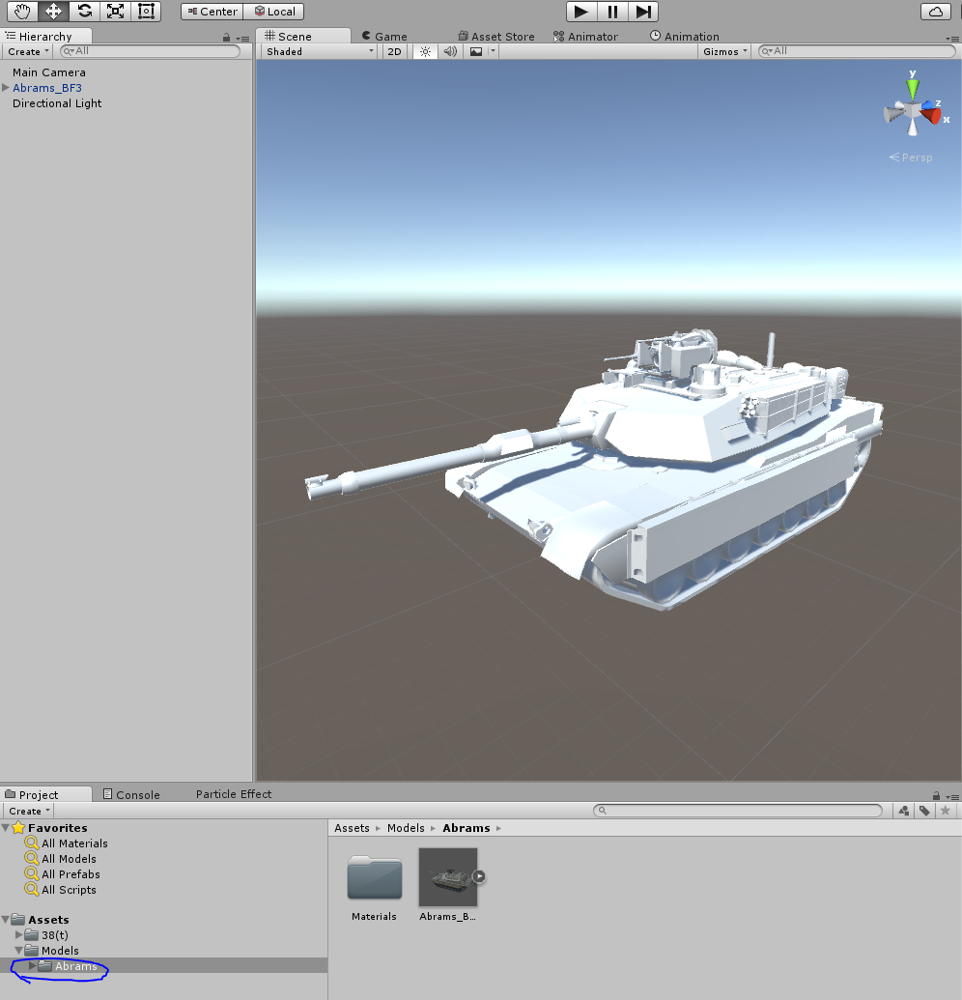

Now drag all of the materials textures into the materials folder.

You will want Tex\_0026\_1

Tex\_0027\_1

Tex\_0025\_1

Track

And Glass textures.


You will notice that the .OBJ file does not map the textures
automagically. Some formats like FBX will do this for you, but many of
the formats won’t. The good news is the model already has UV coordinates
on how to map the texture to it. All we need to do is assign textures to
the materials generated by Unity.

We will talk about UV coordinates in a moment, but first let’s texture
this tank, so that it will make more sense.

So next you will map these textures as follows:

BarrelMat gets Tex\_0026:

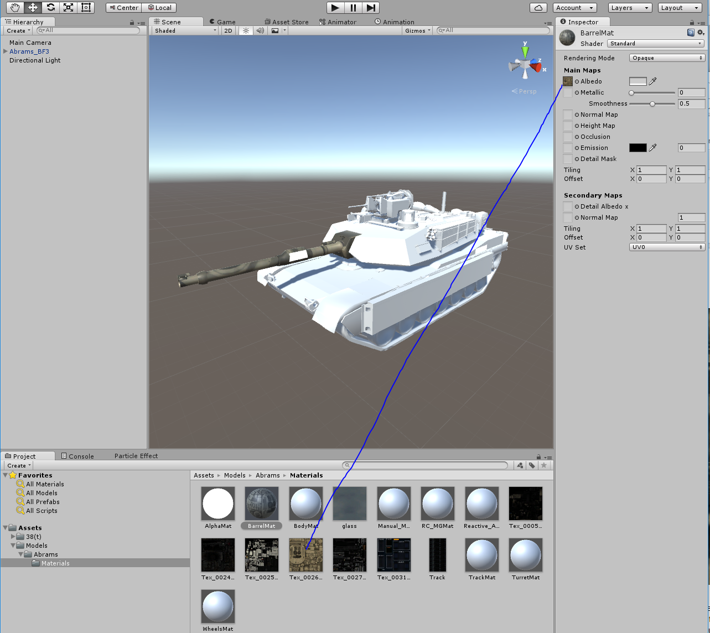

BodyMat also gets Tex\_0026:

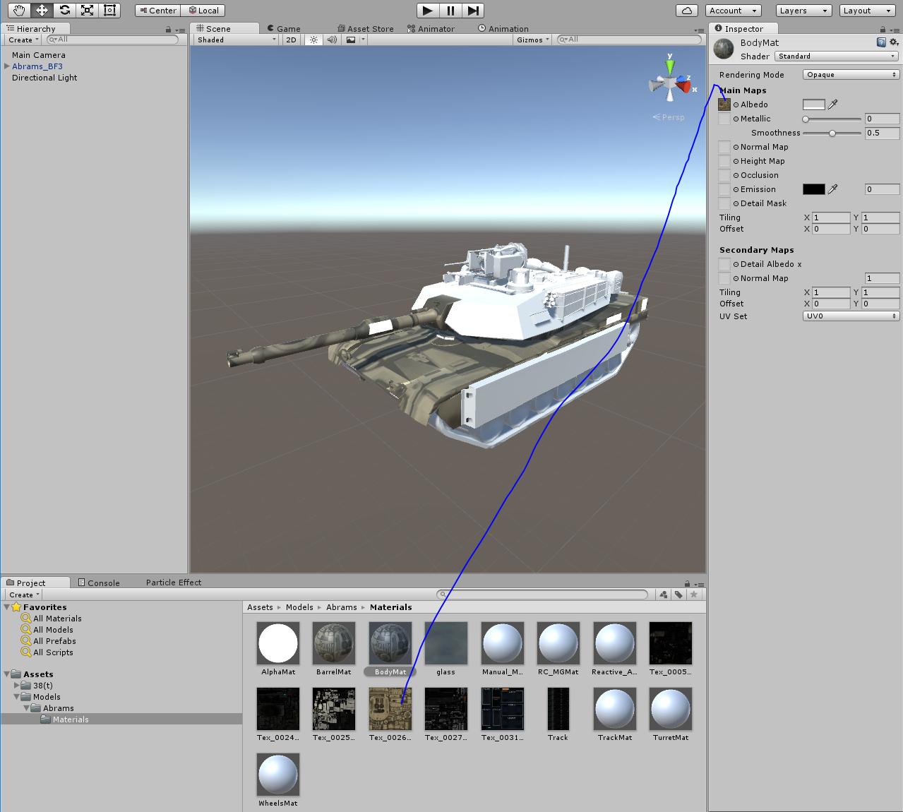

Manual\_MGMat also gets the same texture Tex\_0026.

RC\_MGMat gets Tex\_0005, but we will probably end up cutting this
machine gun out of the final project because it uses too many triangles.
We could reduce the triangle count, but that would require opening the
mesh in a 3d program.

You can see in this screenshot how the material and texture correspond
with a specific part of the mesh. You can also see the triangle
complexity of a mesh by clicking on it. Another good way to see the
complexity is by opening it in a new Unity Scene, running it and
clicking on **STATS** in the upper right corner of the window. The
**STATS** panel will show you the cost to render the scene, including
batch draw calls and polygons. We will talk more about this later when
covering performance and optimization.

So you can see how the machine gun texture maps below:

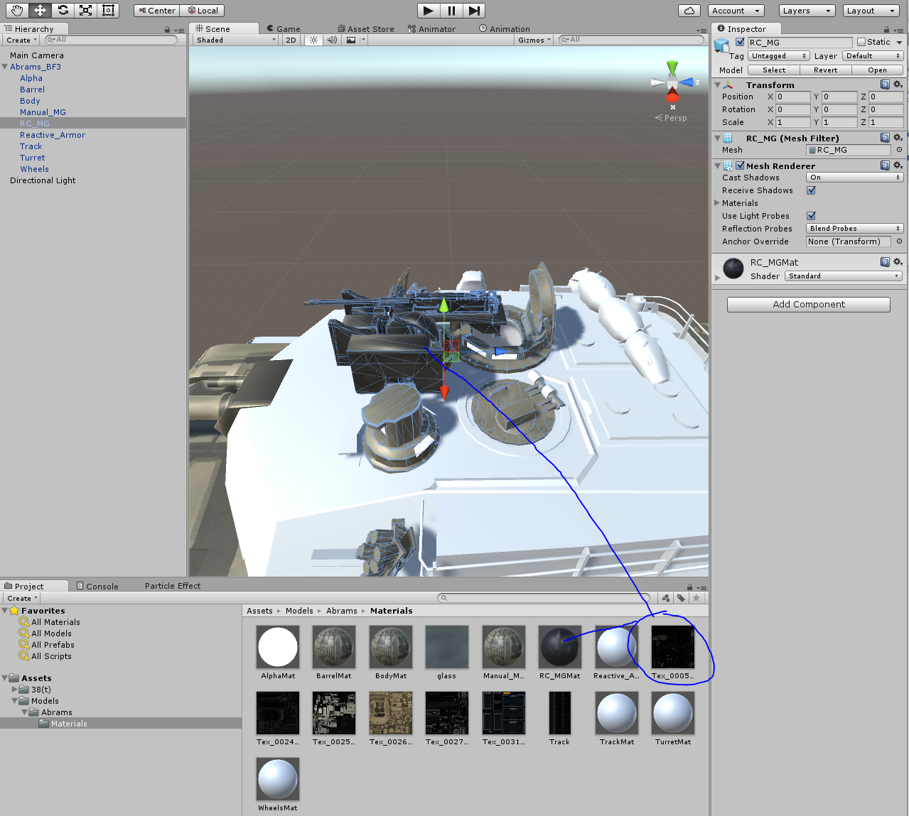

Reactive\_ArmorMat uses the same texture Tex\_0026 once again, but we
are going to remove this part of the model as well to reduce polygon
count.

AlphaMat uses the Glass texture.

TrackMat uses the Track texture.

WheelsMat uses Tex0024

Finally we will take special care to texture the TurretMat, it requires
a Detail map, which is a second texture that will be merged with the
main texture.

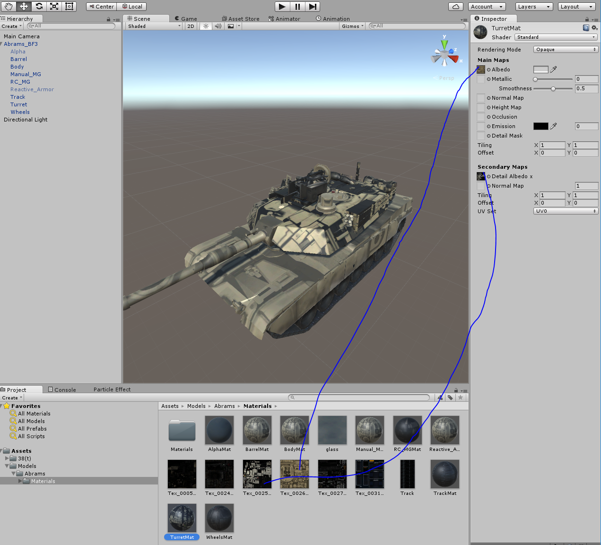

This will detail the cockpit for us and also give us a nice detail map
on the outside of the tank:

Now we have a fully textured tank model!

Now it is time to remove the parts we don’t need to reduce the poly
count, and save the finished tank as a prefab.

So, first we are going to edit the model structure and rename the root
gameobject to Abrams\_BF3\_Prefab.

We will disable Alpha, RC\_MG, and Reactive Armor to lower our
polycount. You could delete it, but why mangle the model?

Then we will drag the root of the GameObject to a new folder called
Prefabs. This will save the Prefab for us to use later:

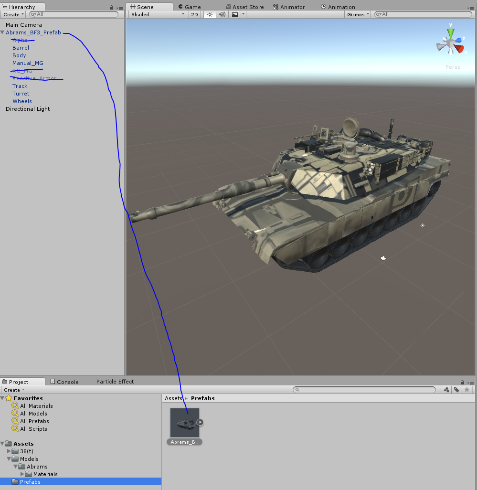

Congratulations! The tank is ready to use in the game. Now we are going
to make a few changes to the inside of the tank.

If you zoom into the tank you can see that there is an interior! This is
why we chose this model, it is very detailed. You will be living inside
this tank and controlling it from the inside.

So please import the SteamVR package into your project and we can get
the VR stuff ready.

Once the VR package is imported you can select the SteamVR Camera Rig
and drag it inside of the Abrams\_BF3\_Prefab GameObject, so it becomes
a child of the tank and will move with the tank. Set the tank’s scale to
2,2,2 and position the CameraRig using the position information
contained in the helper image below. You should also change your Steam
VR\_Play Area to 200x150. This is a game where we want to sit, not run
around the room.

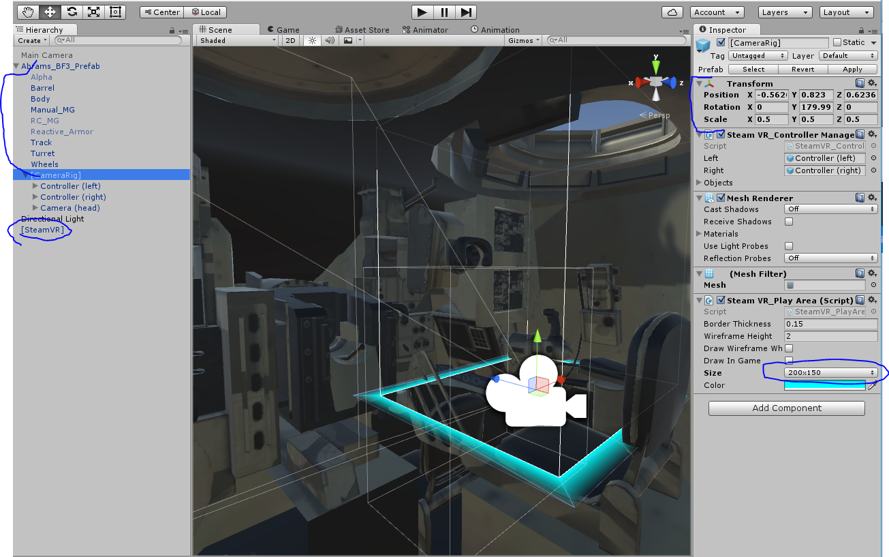

So now we need to think of a way to see the world outside of the tank.
Luckily Unity has just the thing for us. They are called **Render
Textures**. Render textures allow you to make a camera and project what
it sees onto another texture. Perfect for this.

So let’s make a new Material and call it TankCam, and also a
RenderTexture and also call it tank Cam. We will make a Quad and put it
inside the tank. We will also take our Main Camera and put it inside the
tank as well. In the Main Camera settings we can assign the render
texture to it, this will make it draw to the texture. Flip the camera Y
rotation to 180 and set its position to 0,2.017,-9.48. This will put it
right on the bow of the tank.

Next position the Quad inside of the tank as outlined in the graphic
below. Quads only render on one side, so you will need to flip it
around. Also drag the TankCam Material to the quad, and assign the
Unlit/Texture shader (so it looks like a bright screen) and assign the
TankCam texture as the texture to render.

Be sure to apply changes to your prefab so all of your work is saved to
disk.

Here is a picture of the screen you should have. Follow the blue lines
for help.

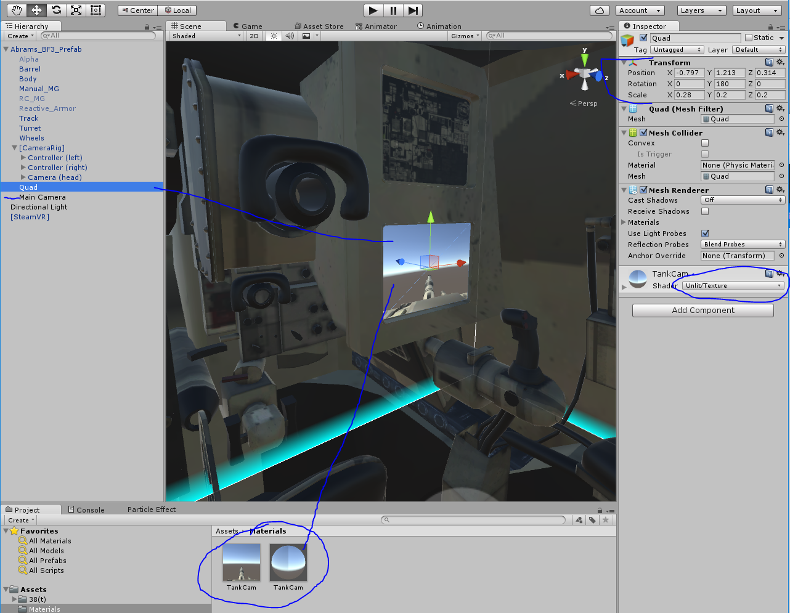

Now if you run it again you will be sitting inside a virtual tank in a
virtual world, with a camera that lets you look outside!

Let’s admit it, the outside is pretty dull right now. We can fix that.
It is time to build the world.

Collapse your Abrams\_BF3\_Prefab and go to
GameObject-&gt;Create-&gt;Terrain to put some terrain into the world.
This kind of game is perfect for terrain. Set the terrain position to
-250,0,-250 and make sure the tank is at 0,0,0.

Honestly this terrain is also kind of boring, but this is where we spice
it up.

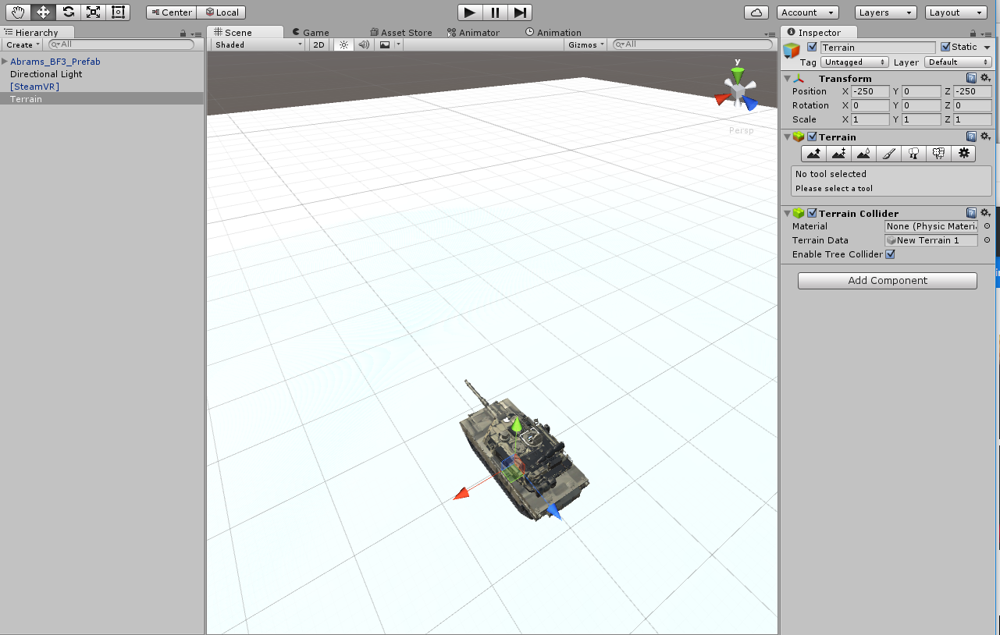

Please import the Standard Environment package that is part of Unity. We
will be using this package to build our environment.

Now add the textures by clicking the brush tool and adding them one at a
time.

We can then use these textures to paint the terrain. Terrain is
expensive in Unity, but it gives a good effect so we will use it for
this game.

We can learn some optimization tricks at the end of this tutorial.

Next we can learn about terrain heightmaps. You can mold the terrain and
raise and lower its height, this saves a grayscale height map. Each
shade of gray represents a different height for a specific point on the
terrain.

So let’s switch to the terrain raise tool on the far left and raise the
terrain to paint a little environment for our tank.

Make a little path, paint the road then paint little mountains to
occlude the tank view and create the illusion of being in on a mountain
path.

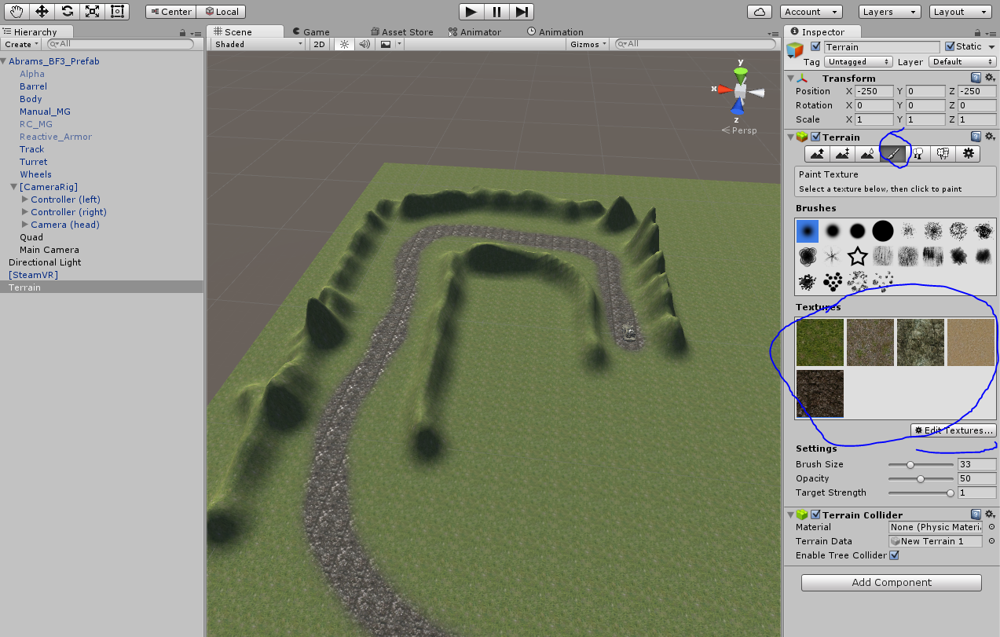

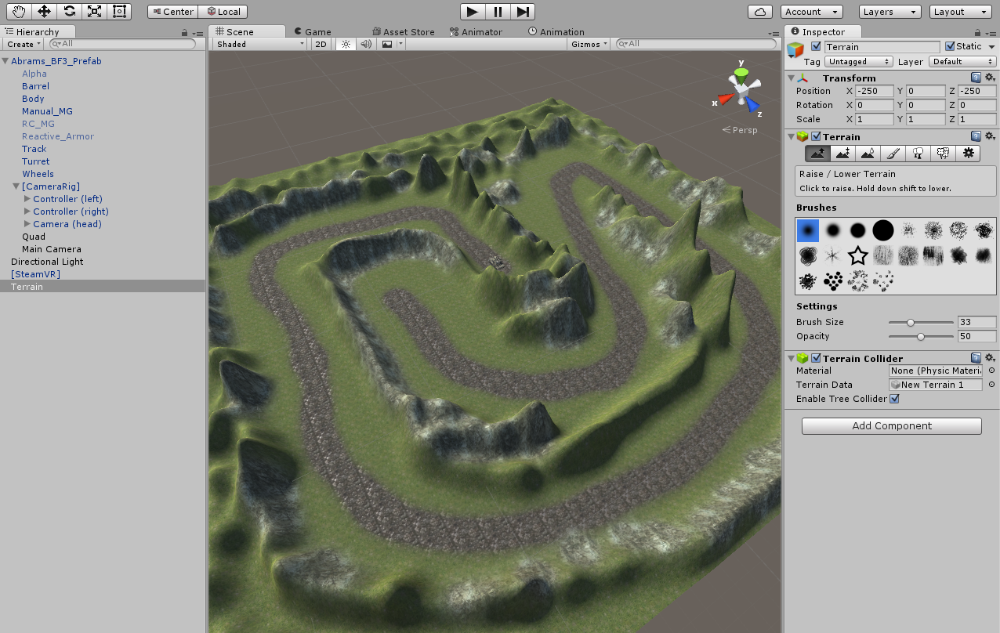

Feel free to paint and play and build a nice little compelling
environment for your tank.

After you have a nice environment it is time to make the tank move!
First let’s change the prefab a little bit. Group the Body with the
Track and Wheels so we can rotate it while turning. Also add a RigidBody
and Box collider to the tank, and a rigidbody set to Kinematic on the
terrain.

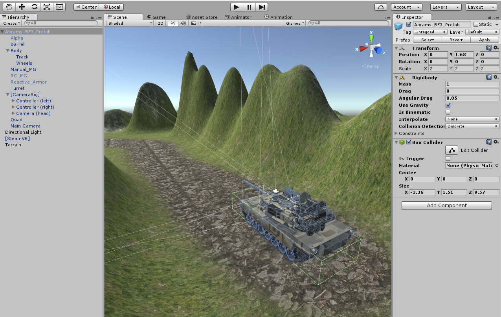

Kinematic means the object will be part of the physics simulation, but
it will be fixed in space, and other objects can crash into it, but it
will not move. Our terrain will be this. It will be fixed and not move
and the tank will move on top of it.

Now we can focus on the controls that the user will use inside the tank.
The Tank is controlled by the TankControlScript which should be attached
to your Camera Rig.

We will design these controls so that the user can grab them with their
hands and manipulate them to control the tank. It is also possible to
make the tank controls mimic the current state of the tank if the user
decides to use a joystick.

Lets go through the hand controller system now.  You should attach this script
to the hands.

Here is the code for this script:

~~~
using UnityEngine;
using System.Collections;

public class HandGrabber : MonoBehaviour {
    public GameObject grabTarget = null;
    public GameObject selectionObject;
    public bool isGrabbing = false;
    public GameObject selection;
    public bool isLeftHand;
    public bool isRightHand;
    private float startPosition = 0f;
    private float targetStartPosition = 0f;
    void Start () {

	}

	void Update () {

        SteamVR_Controller.DeviceRelation idx = SteamVR_Controller.DeviceRelation.FarthestRight ;
        //Assign hands based on furthest left or furthest right location.
        if (isLeftHand) idx = SteamVR_Controller.DeviceRelation.Leftmost;
        if (isRightHand) idx = SteamVR_Controller.DeviceRelation.FarthestRight;

        int hand = SteamVR_Controller.GetDeviceIndex(idx);

        //Control isGrabbing Flag
        if(!isGrabbing && (SteamVR_Controller.Input(hand).GetHairTriggerDown()))
        {
            isGrabbing = true;
        }
        if(isGrabbing && (SteamVR_Controller.Input(hand).GetHairTriggerUp()))
        {
            isGrabbing = false;
            selection = null;
        }
        if (isGrabbing && grabTarget != null && selection == null)
        {
            selection = grabTarget;
            targetStartPosition = selection.transform.localPosition.z;
            startPosition = this.transform.position.z;
        }


        selectionObject.SetActive(selection != null);
        if (selection != null)
        {
			//This code might confuse you.. We are moving the sticks in worldspace, but the sticks are in localspace.  This is a method to constrain the Z coordinate to specific ranges in local space, but affect
			//them from the world space hand controllers, and move them relative to the hand controllers.
            Vector3 lastPos = selection.transform.localPosition;
            selection.transform.position = this.transform.position;
            float zPos = Mathf.Clamp(selection.transform.localPosition.z, 0.15f,0.45f);
            selection.transform.localPosition = new Vector3(lastPos.x, lastPos.y, zPos);
        }
    }

    void OnTriggerExit(Collider c)
    {
        if(c.gameObject == grabTarget)
        {
            Debug.Log("Collision Left GrabTarget");
            grabTarget = null;
            isGrabbing = false;
            selection = null;
        }
    }

//Only trigger enter on objects tagged Control
    void OnTriggerEnter(Collider c)
    {
        if(grabTarget == null && c.tag == "Control")
        {
            Debug.Log("Collision Entered Controllable Surface");
            grabTarget = c.gameObject;
        }
    }
}
~~~

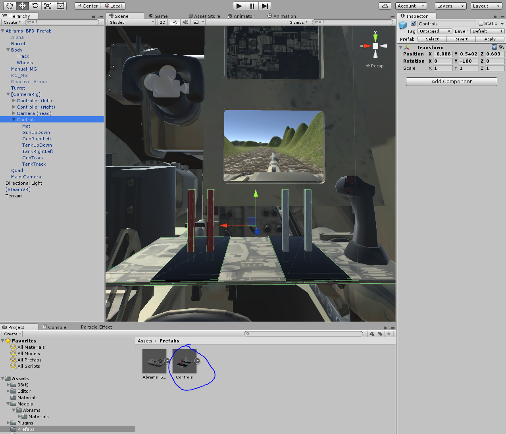

This is a very important script, so let’s examine how it works:

~~~
using UnityEngine;
using System.Collections;
using System;

public class TankControlScript : MonoBehaviour {

    private Vector3 respawnPosition;
    public GameObject GunStickUpDown;
    public GameObject GunStickLeftRight;
    public GameObject TankMoveForwardBackward;
    public GameObject TankMoveLeftRight;
    public GameObject TankFireButton;

    public GameObject TankBody;
    public GameObject TankTurret;

    public Rigidbody TankRigidBody;

    public GameObject BulletSpawner;
    public GameObject BulletPrefab;
    public GameObject SmokePrefab;

    public AudioSource rotateTurretSound;
    public AudioSource rollTankSound;
    public AudioSource dieSound;

    private Vector2 GunControlPosition = new Vector2(0.5f, 0.5f);
    private Vector2 TankControlPosition = new Vector2(0.5f, 0.5f);
    private float timeLeftToReload = 0f;

    public float reloadTime = 1f;
    public float turnSpeed = 0.1f;
    public float accelerationSpeed = 0.1f;
    public float maxMoveVelocity = 1f;
    public float turretRotationSpeed = 0.5f;
    public float bulletForce = 100f;
    public Vector4 MaxTankTurretRanges = new Vector4(-14f, 14f, 0f, 8f);
    public Vector2 MaxBodyRotationRange = new Vector2(-50f, 50f);

    public bool KeyboardEnabled = true;
    public bool TouchControllersEnabled = false;

	void Start () {
        respawnPosition = this.transform.position;
    }

	void Update () {
        if (KeyboardEnabled)
        {
            ProcessKeyboardInputs();
            DrawControlState();
        }
        if(TouchControllersEnabled)
        {
            ReadControlState();
        }
        ApplyStateToTank();
    }

    private void ApplyStateToTank()
    {

        rollTankSound.mute = !(TankControlPosition.y < 0.45f || TankControlPosition.y > 0.55f);
        Quaternion newRotation = Quaternion.Euler(new Vector3(
        Mathf.Lerp(MaxTankTurretRanges.z, MaxTankTurretRanges.w, GunControlPosition.y),
            Mathf.Lerp(MaxTankTurretRanges.x, MaxTankTurretRanges.y, GunControlPosition.x),
        0f));
        TankTurret.transform.localRotation = newRotation;

        newRotation = Quaternion.Euler(new Vector3(
        0f,
        Mathf.Lerp(MaxBodyRotationRange.x, MaxBodyRotationRange.y, TankControlPosition.x),
        0f));

        TankBody.transform.localRotation = newRotation;
        Vector3 rotationVector = new Vector3(0f, Mathf.Lerp(-50f, 50f, TankControlPosition.x), 0f);
        Vector3 force = (TankBody.transform.forward.normalized + newRotation.eulerAngles.normalized) * Mathf.Clamp(accelerationSpeed * Mathf.Lerp(1,-1,TankControlPosition.y),
            -maxMoveVelocity,
            maxMoveVelocity);
        TankRigidBody.AddForce(-TankRigidBody.velocity, ForceMode.VelocityChange);
        TankRigidBody.AddForce(force, ForceMode.VelocityChange);
        if (timeLeftToReload > 0f) timeLeftToReload -= Time.deltaTime;
    }

    private void DrawControlState()
    {
        Vector3 pos = GunStickUpDown.transform.localPosition;
        pos.z = Mathf.Lerp(0.45f, 0.15f, GunControlPosition.y);
        GunStickUpDown.transform.localPosition = pos;

        pos = GunStickLeftRight.transform.localPosition;
        pos.z = Mathf.Lerp(0.15f, 0.45f, GunControlPosition.x);
        GunStickLeftRight.transform.localPosition = pos;

        pos = TankMoveLeftRight.transform.localPosition;
        pos.z = Mathf.Lerp(0.15f, 0.45f, TankControlPosition.x);
        TankMoveLeftRight.transform.localPosition = pos;

        pos = TankMoveForwardBackward.transform.localPosition;
        pos.z = Mathf.Lerp(0.45f, 0.15f, TankControlPosition.y);
        TankMoveForwardBackward.transform.localPosition = pos;
    }

     private void ReadControlState()
     {
        float min = 0.15f;
        float max = 0.45f;
        Vector3 pos = GunStickUpDown.transform.localPosition;
        float value = pos.z - min;
        value = value / (max - min);
        GunControlPosition.y = value;

        pos = GunStickLeftRight.transform.localPosition;

        value = pos.z - min;
        value = value / (max - min);
        GunControlPosition.x = value;

        pos = TankMoveLeftRight.transform.localPosition;
        value = pos.z - min;
        value = value / (max - min);
        TankControlPosition.x = value;

        pos = TankMoveForwardBackward.transform.localPosition;
        value = pos.z - min;
        value = value / (max - min);
        TankControlPosition.y = value;
     }

    private void ProcessKeyboardInputs()
    {
        bool rotateTurretMute = true;
        if(Input.GetKey(KeyCode.Space) && timeLeftToReload <= 0f)
        {
            FireCannon();
        }
        if (Input.GetKey(KeyCode.UpArrow))
        {
            TankControlPosition.y += accelerationSpeed * Time.deltaTime;
            if (TankControlPosition.y >= 1f) TankControlPosition.y = 1f;
        }
        if (Input.GetKey(KeyCode.DownArrow))
        {
            TankControlPosition.y -= accelerationSpeed * Time.deltaTime;
            if (TankControlPosition.y <= 0f) TankControlPosition.y = 0f;
        }
        if (Input.GetKey(KeyCode.LeftArrow))
        {
            TankControlPosition.x -= turnSpeed * Time.deltaTime;
            if (TankControlPosition.x <= 0f) TankControlPosition.x = 0f;
        }
        if (Input.GetKey(KeyCode.RightArrow))
        {
            TankControlPosition.x += turnSpeed * Time.deltaTime;
            if (TankControlPosition.x >= 1f) TankControlPosition.x = 1f;
        }

        if (Input.GetKey(KeyCode.S))
        {
            rotateTurretMute = false;
            GunControlPosition.y -= turretRotationSpeed * Time.deltaTime;
            if (GunControlPosition.y <= 0f) GunControlPosition.y = 0f;
        }
        if (Input.GetKey(KeyCode.W))
        {
            rotateTurretMute = false;
            GunControlPosition.y += turretRotationSpeed * Time.deltaTime;
            if (GunControlPosition.y >= 1f) GunControlPosition.y = 1f;
        }
        if (Input.GetKey(KeyCode.A))
        {
            rotateTurretMute = false;
            GunControlPosition.x -= turretRotationSpeed * Time.deltaTime;
            if (GunControlPosition.x <= 0f) GunControlPosition.x = 0f;
        }
        if (Input.GetKey(KeyCode.D))
        {
            rotateTurretMute = false;
            GunControlPosition.x += turretRotationSpeed * Time.deltaTime;
            if (GunControlPosition.x >= 1f) GunControlPosition.x = 1f;
        }
        rotateTurretSound.mute = rotateTurretMute;
    }

    private void FireCannon()
    {
        timeLeftToReload = reloadTime;
        Destroy((GameObject)Instantiate(SmokePrefab, BulletSpawner.transform.position, Quaternion.identity), 7f);
        GameObject bullet = (GameObject)Instantiate(BulletPrefab, BulletSpawner.transform.position, Quaternion.identity);
        bullet.GetComponent<Rigidbody>().AddForce(BulletSpawner.transform.forward * bulletForce);
    }

    public void BulletHit()
    {
        //Hit by a bullet.
        this.GetComponent<Rigidbody>().isKinematic = true;
        this.transform.position = respawnPosition;
        this.GetComponent<Rigidbody>().isKinematic = false;
        dieSound.Play();
    }
}
~~~

Every frame we run a check if the Keyboard controls are enabled, if they
are we run ProcessKeyboardInputs() to update the data models for
GunControlPosition and TankControlPosition, then we run
DrawControllerState() to synchronize the positions of the levers with
our model values.

Then we check if TouchControllersAreEnabled and if they are we do the
opposite and ReadControlState() to read the positions of the levers and
translate them back into model values. When you have a touch controller
you physically move the levers back and forth and their position
correlates with a value between 0 and 1. This value uses Linear
Interpolation (**LERP**) to interpolate all the rest of our tank
position values, from the speed to the rotations and angles of all of
the different parts of the tank as it moves.

LERP is very important, it allows you to find a value between two ranges
based on another value between 0 and 1.

So for example, if I have a slider and it’s value is 0 to 1, and I want
to map it to a number between 1 and 100 I can use LERP and it will
translate 0.5 into 50. You might say, wow that’s stupid, I can just use
percentages for that and multiply 0.5 \* 100 = 50.

Well, that is true, but that only works when you are doing 1 out of 100.

Of course you can also divide to give you a percentage when you have a
number along a range like 32 / 192 = 0.16666, so we know that 32 is
16.66% of 192. But again that is assuming you are dealing with the range
of 0 to 192. If you are dealing with 30 - 192, 32 is no longer 16% of
the total, and if you want to find out what number is 16% of the way
along of 30-192 you use LERP.

What makes LERP really powerful is when you LERP very weird number
ranges like -45 and 30. 0.5 will still find the midway point between
those two numbers. 0.25 will find the ¼ point between those numbers.
This helps us figure out exact rotation amounts based on the lever
locations in the cockpit.

Unity has a very nice helper function for this called
Mathf.LERP(minRange, maxRange, percentage (0-1));

Finally there is method here to fire the cannon, it’s pretty
straightforward, it makes some smoke and a cannonball and honors reload
time.

Now we need to attach the Main Camera to the barrel, so that when we
look with the barrel the camera will follow it. We should also lock the
X coordinate and Z rotation and the Y position of the rigid body so that
the tank won’t climb the mountains. The reason for this is the tank will
move along its forward vector, so if it tilts upward it will start
climbing into the sky. There are ways to fix this, but for this game it
is acceptable to just lock the rotation and position of the Rigidbody.

You can see all of these settings below:

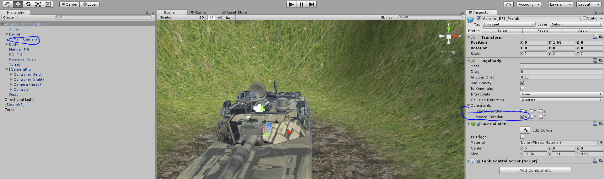

Also add a Bullet Spawner to the front of the tank barrel. This will be
the location that the bullet, smoke, and fire will be spawned when we
shoot the cannon. Use this image as a reference of where to put it. Also
make sure it is rotated correctly so we can use its Vector3.forward
property to determine the angle to launch the bullet.

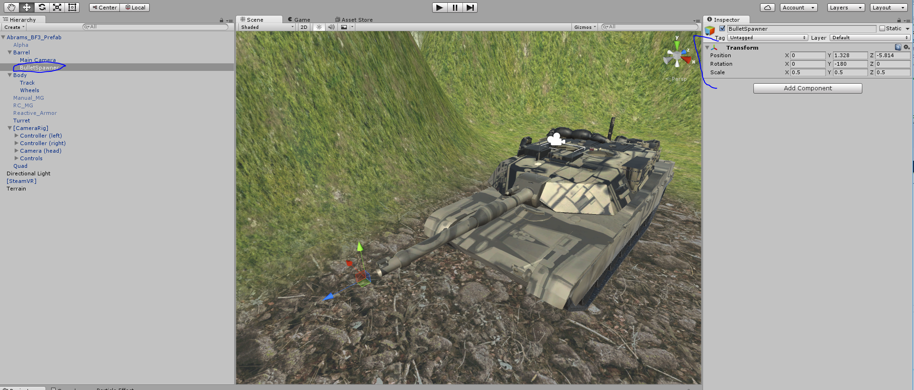

Now we can get to the fun stuff. Let’s make our first tank bullet.
Create a new Sphere and call it TankShell. Then create a TankShell
Material in our Materials folder. Drag it to the tank shell, paint it
black, and drag the shell to our prefabs folder:

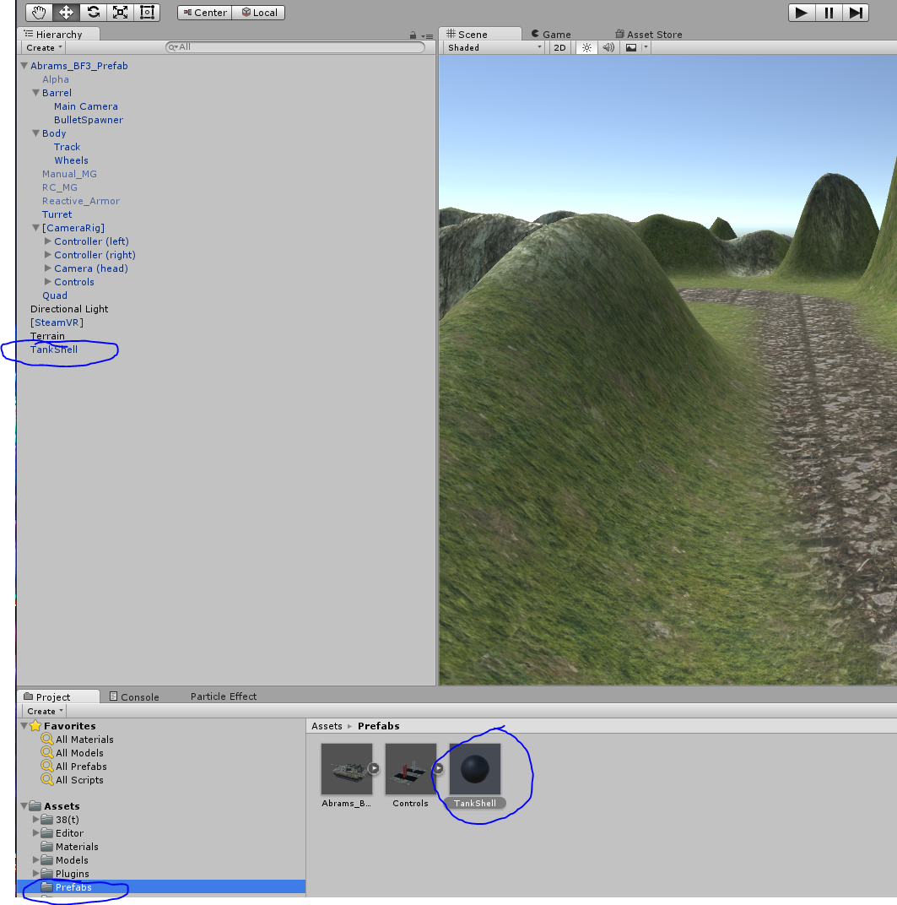

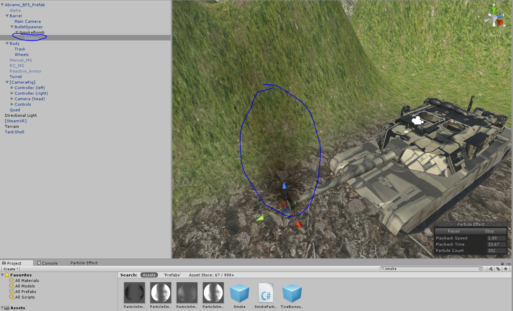

We can now create a particle system to spray smoke out when the cannon
goes off, and when the shell lands.

So import the standard ParticleSystems package from Unity under the
Assets menu.

Now you can attach Smoke to our BulletSpawner so we can see how it will
appear when it spawns at the front of the tank during a shot. Obviously
this smoke prefab isn’t right for us, but we can change it to do exactly
what we want...Let’s do that now.

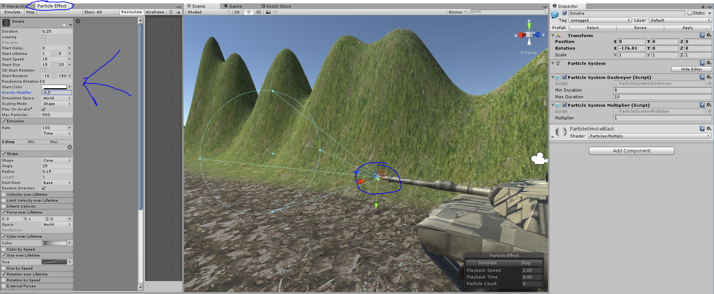

Click the smoke particle system then click Open Editor to view the
particle editor, this will let you simulate and stop the effect and test
it. Copy the settings you see on the left panel. A particle system lets
you spawn hundreds of tiny textures that blend with the environment for
a cheap cost. You can control the behavior of these tiny instances over
time. We want the duration to be short, this is an explosion from a gun,
so set the Duration to 0.25. Make sure Looping is off, this is a one
shot kind of thing.

We want the smoke to linger so set the Start Lifetime to 1 to 5, this
means each particle has a random lifetime of beween 1 and 5 seconds.

Start Speed will be 15, this will make the smoke propel forward at a
fast speed from the front of the cannon.

Start Size should be 15 to 25, this will control the scale of each
smokelet.

The Rotation is fine -18 to 180 this will control how the particles
rotate as they are emitted.

Gravity Modifier will control how gravity affects the particles. Smoke
rises, so we want to add a slight -0.5 modifier to make it slowly rise
into the air.

Simulation Space World means that the smoke will exist in the world,
this is important because if we make the smoke a child of the tank we
still want the smoke to float in the world and not follow the tank
around.

Max particles 500 is fine, that is the maximum this engine can spawn.

Emission should be 100, we want 100 quick particles when the system is
created.

Shape should be Cone, we can then rotate the cone to come out of the
front of the cannon and the smoke will fly forward as expected.

You will need to adjust Color over Lifetime. This property controls how
opaque or transparent the smoke will be, and if it is tinted. The
standard black tint is fine, but adjust the alpha settings so the smoke
stays solid for longer.

That should be it. Now when you press Simulate at the top the smoke
explosion effect will look quite realistic.

Now drag your SmokeEffect to your Prefabs folder so we can create it
whenever we want.

Now we can make a Tank Chase Cam to give us another view of our tank
inside the cockpit. Why not? Let’s have more than one screen to look at,
the advantage of VR!

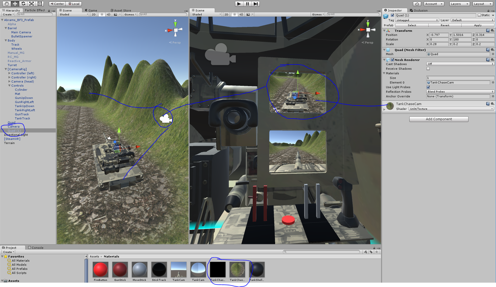

All we gotta do is make another RenderTexture, and another Material for
it. So make TankChaseCam RenderTexture and Material, then bind them
together as we did earlier for the first chasecam. Then we will
duplicate the quad we already have and move it up into position above
the other one. Then we can attach our camera to the tank and hover it
above the tank as shown in the picture, make sure it renders to our
render texture, and that’s really all you have to do.

Now for the Bullet, let’s make a bullet and a bullet script. Go back to
TankShell and create a script on it called BulletShell.

This script will be really simple:

~~~
using UnityEngine;
using System.Collections;

public class BulletShell : MonoBehaviour {
    public GameObject ExplosionPrefab;
    void OnTriggerEnter(Collider c)
    {
        c.gameObject.SendMessage("BulletHit", SendMessageOptions.DontRequireReceiver);
        Destroy((GameObject)Instantiate(ExplosionPrefab, this.transform.position, Quaternion.identity), 7f);
        Destroy(this.gameObject);
    }
}
~~~

We are waiting for a collision of any kind, when the bullet collides
with anything it will destroy itself, spawn an explosion, and send a
message to that object called BulletHit. The object it sends the message
to will decide what to do with BulletHit. This is good design, because
the bullet is doing it’s job beautifully, but it is not deciding how to
affect anyone else, it is simply letting them know if it hits them. Now
when we make enemy tanks all we need to do is give them a BulletHit
method, and whenever they get hit by a bullet we can make them get hurt
or die.

As you can see we also bind a public variable

**public GameObject ExplosionPrefab;**

ExplosionPrefab is the prefab we want to spawn when the bullet explodes.
Note how we Instantiate this prefab:

Destroy((GameObject)Instantiate(ExplosionPrefab,
this.transform.position, Quaternion.identity), 7f);

It looks like a lot of stuff, but it is simple: Destroy() tells the
object to be destroyed (at the end there you can see 7f, which means
after 7 seconds). This ensures the particle system gets cleaned up after
it’s done.

(GameObject)Instantiate is a cast of the result of Instantiate to
GameObject.

Then we decide what we want to instantiate, which is ExplosionPrefab,
and we want to put it right where the bullet is at a 0,0,0 rotation
(Quaternion.identity)

We almost have a complete game now. All we need are some enemies and a
goal.

So to create enemies let’s get an asset from the asset store. There is a
really low polygon tank called 38t. It is included in your lesson
package under Prefabs, it is called Enemy\_Tank. We are going to use
this tank to be our enemy and create a brain for it, to allow it to move
around the world.

First make a gameobject called Enemy\_Tanks, this will be the root node
for all of our enemies, and drag enemies around the map and make them
part of the Enemy\_Tanks node.

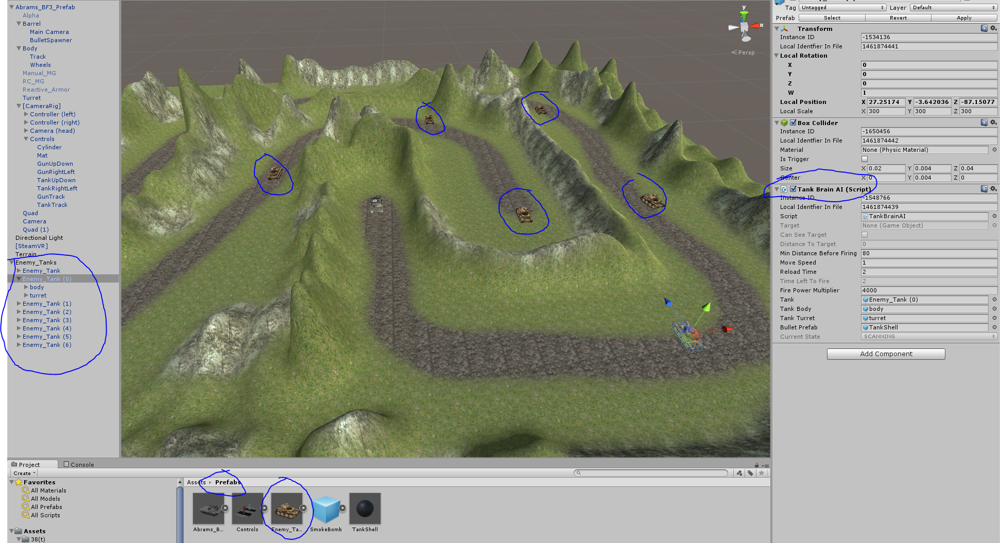

Now we should add some tags into the game. These tags are going to be
used to handle raycasting to find the player, and also to detect the
terrain.

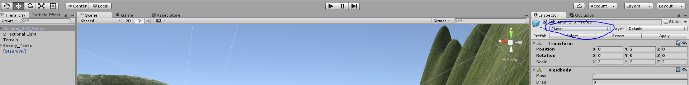

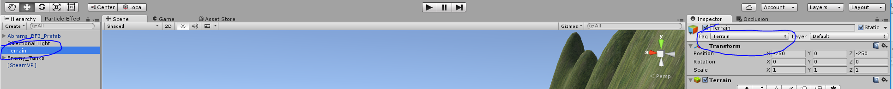

Enemy Tanks already has the brain script attached to it, here is a
rundown of how it works:

We have 2 main methods that run every frame on Update():

UpdateState();

TickState();

UpdateState examines the current state and decides if we need a new
state or not.

TickState moves the current state forward in whatever way it can.

UpdateState will first call CheckTargetVisible() which will shoot a
raycast from the enemy tank to the player. If it hits terrain it sits
around and waits until the player comes into view. Once the player is in
view it switches its state to GETTING\_CLOSER, if the tank is out of
range to fire then it starts moving in the direction of the player until
either the player leaves view again or it gets within range. Once it is
within range it fires as fast as possible (and reloads) until it either
gets out of range again or out of view again or dies.

It is relatively simple AI, it won’t roam around searching for the
player or chase the player around a corner, this would require a bunch
of additional stuff to examine the surrounding terrain and path find the
way to the player, this is all doable but outside the scope of this
tutorial.

You can examine the code here:

~~~
using UnityEngine;
using System.Collections;

public class TankBrainAI : MonoBehaviour {
    private GameObject target;
    private bool canSeeTarget;
    private float distanceToTarget;
    public float minDistanceBeforeFiring = 10f;
    public float moveSpeed = 1f;
    public float reloadTime = 2f;
    private float timeLeftToFire = 2f;
    public float firePowerMultiplier = 4000f;
    public GameObject tank;
    public GameObject tankBody;
    public GameObject tankTurret;
    public GameObject BulletPrefab;
    public int counter = 0;
    private BrainState currentState;
    public enum BrainState
    {
        SCANNING,
        GETTING_CLOSER,
        FIRING
    }
	// Use this for initialization
	void Start () {
        target = GameObject.FindGameObjectWithTag("Player");
	}

	// Update is called once per frame
	void Update () {
        UpdateState();
        TickState();
	}

    private void UpdateState()
    {
        CheckTargetVisible();
        if (canSeeTarget == false)
        {
            currentState = BrainState.SCANNING;
            return;
        }
        if(distanceToTarget <= minDistanceBeforeFiring)
        {
            currentState = BrainState.FIRING;
        }
        else
        {
            currentState = BrainState.GETTING_CLOSER;
        }
    }

    private void TickState()
    {
        switch (currentState)
        {
            case BrainState.GETTING_CLOSER:
                tank.transform.LookAt(target.transform);
                this.transform.position = Vector3.MoveTowards(this.transform.position, target.transform.position, moveSpeed * Time.deltaTime);
                break;
            case BrainState.FIRING:
                if(timeLeftToFire >= 0f)
                {
                    timeLeftToFire -= Time.deltaTime;
                    return;
                }
                else
                {
                    Fire();
                }
                break;
        }
    }

    private void Fire()
    {
        //Always look at the target before you fire.
        tank.transform.LookAt(target.transform);
        GameObject bullet = (GameObject)Instantiate(BulletPrefab, tankTurret.transform.position, Quaternion.identity);
        bullet.GetComponent<Rigidbody>().AddForce(tank.transform.forward * firePowerMultiplier);
        timeLeftToFire = reloadTime;
    }

    public void BulletHit()
    {
        //Bang Bang...
        tankTurret.transform.parent = null;
        tankBody.transform.parent = null;
        tankBody.AddComponent<SphereCollider>();
        tankTurret.AddComponent<SphereCollider>();
        Rigidbody body = tankBody.AddComponent<Rigidbody>();
        body.AddExplosionForce(100f, this.transform.position - (this.transform.up * 2f), 3f);
        Rigidbody turret = tankTurret.AddComponent<Rigidbody>();
        turret.AddExplosionForce(50f, this.transform.position - (this.transform.up * 2f), 2f);
        Destroy(this.gameObject, 3f);
        Destroy(turret.gameObject, 7f);
        Destroy(body.gameObject, 7f);
    }

    private void CheckTargetVisible()
    {
        counter++;
        //This is a trick to make it only raycast once every 20 frames, so we can reduce the cost of raycasting.
        if (counter % 20 == 0)
        {
            RaycastHit hit;
            canSeeTarget = false;
            Vector3 origin = this.transform.position + (this.transform.up * 5f);
           // Debug.DrawLine(origin, (target.transform.position - origin) * 100f, Color.blue, 4f);
            if (Physics.Raycast(origin, (target.transform.position - origin) * 100f, out hit))
            {
                if (hit.collider.tag == "Terrain")
                {
                    return;
                }
                if (hit.collider.tag == "Player")
                {
                    canSeeTarget = true;
                    distanceToTarget = Vector3.Distance(this.transform.position, target.transform.position);
                }
            }
        }
    }
}
~~~

Finally we need to add some sound effects to really get us into the
game.

I have included a number of sounds from the Ultimate Sound FX pack, they
are in the Sounds folder. You can use these sounds in your own games if
you purchase a license for the pack.

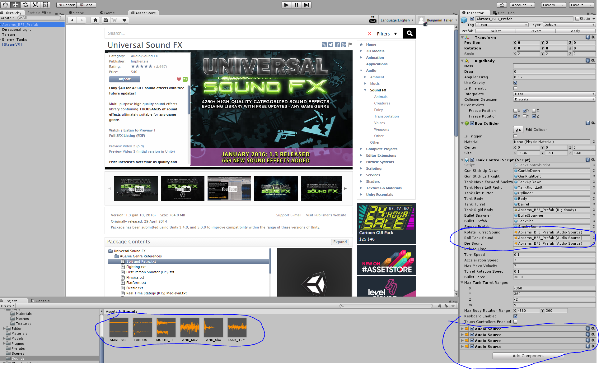

Now you can see we have attached 4 audio sources to our main tank. These
include the death sound, the rotate turret sound, the tank movement
sound, and ambient forest wind sound.

We turn all of them to on and loop, but mute them, all except for the
death sound. The death sound is played by script when necessary. The
wind sound is always looping, the rotate turret sound is unmuted while
the turret is being rotated, and the tank movement sound is unmuted
while the tank movement speed is above 5% in either direction. The
explosion sound is attached to the explosion effect and autoplays, and
the tank\_shot sound effect is attached to the bullet. So whenever
anyone, enemy or player shoots a bullet it will play.

Make sure all of your TankControlScript public variables are mapped in
editor like this:

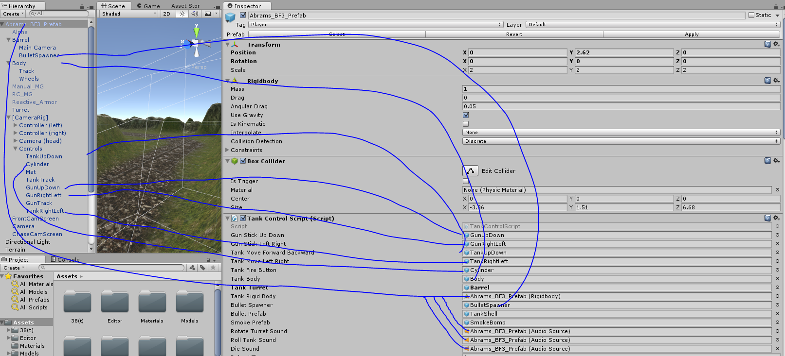

Finally we added some death respawner code to our player so when the
player is shot they jump back to the respawn position and play the death
sound. It doesn’t reset the level, but it can be frustrating because you
need to go all the way back to where you were from the beginning. Kind
of fun to try to make it to the end.

So this concludes our tank game tutorial, I hope you enjoyed it. As
always you can see the final scene file if you have any questions how to
put anything together, but it is always best to rebuild the scene file
from scratch so you understand everything.

Happy VRing!
