>[action]
>To begin, create a new 3D Unity project, as usual.

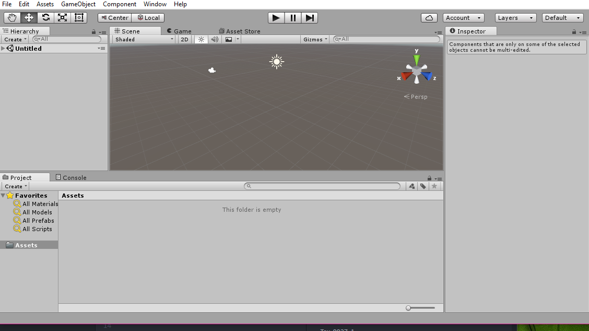

Let's get a Tank in here.

We could get one that's ready to go, but for illustrative purposes, we're going to show you how to apply Textures to someone else's model.

>[action]
>Download the free Tank from [TF3DM.com](http://tf3dm.com/download-page.php?url=m1a2-abrams-with-interior-33521) via the download button at the bottom of the page; as always, when working with assets you obtain from a source other than the Asset Store, be sure to check licensing details before using the asset in your game.

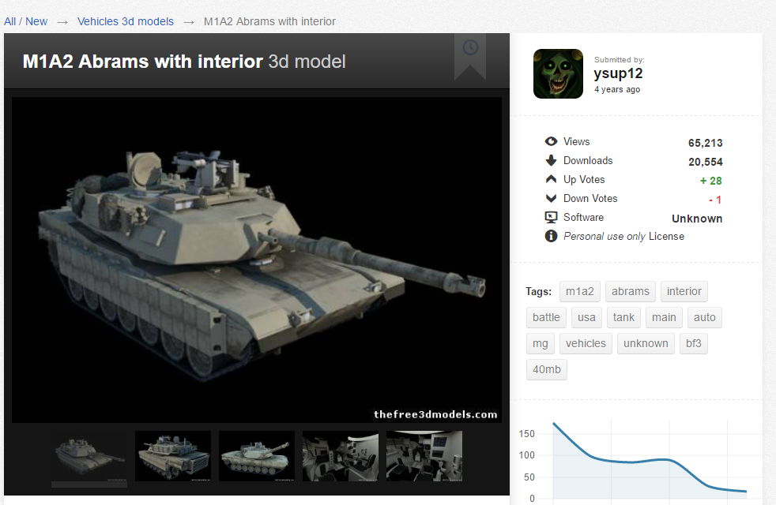

We can use the image from the download page as a reference when we apply textures.

>[action]
>Extract the folder you just downloaded by right-clicking and selecting "Extract All..."

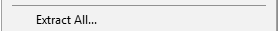

>[action]
>Create a folder in your project called "Models" and drag in Abrams_BF3.obj into that folder.  When you do, a Materials folder should be automagically generated next to the expected model.

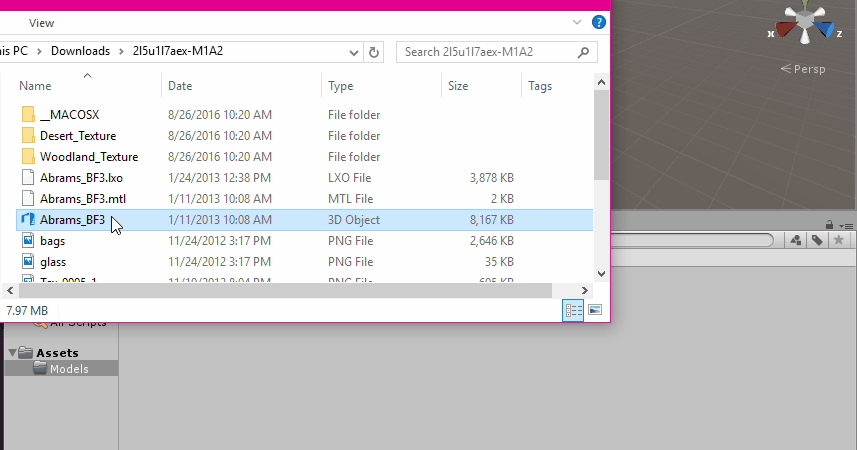

>[info]
>Note that, depending on your settings, Windows may not display your file extensions for all file types.

<!-- -->

>[action]
>Next, create a Textures folder and drag in all the Textures.  Note that some textures are located within subfolders; there were two Textures named "Turret," so Unity renamed one of them for us.

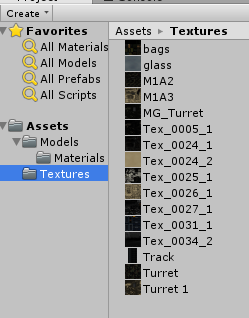

Since we didn't make this model and don't personally know the modeler, dragging in all the Textures is a good idea, since we're not yet sure which ones we'll need and we can quickly switch them out if they're all in Unity.

Time to texture this Tank!

>[action]
>Create an Empty Game Object named "Tank" and drag Models/Abrams_BF3 under it as a child.

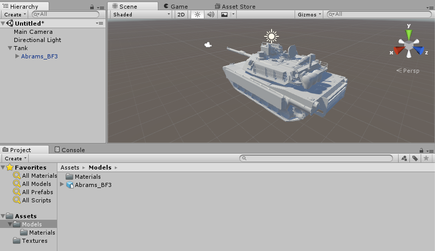

You will notice that the model does not automagically map the textures like the bowling pin did.  Some formats, like .fbx will do this for you, but many formats, like .obj, will not. The good news is that it *did* generate a Material for every piece, and the Materials perform an action called UV-mapping of Textures, a process that maps the flat Textures to them, so all we need to do is assign the right Texture or Textures to each Material.

>[action]
>Go ahead and Texture the Tank.  The best fits we could find were the following:
- AlphaMat -> glass
- BarrelMat -> M1A3
- BodyMat -> M1A3
- Manual_MGMat -> Tex_0027_1
- RC_MGMat -> Tex_0027_1
- Reactive_ArmorMat -> M1A3
- TrackMat -> Track
- TurretMat -> Tex_0025_1
- WheelsMat -> M1A3

As you can see, the mappings aren't perfect. It looks like the artist who designed the Textures intended for the bags on the back, for example, to use the bags Texture, but the Model we have includes the bags on the same mesh as the Turret. Because of this, we had to make a few decisions.

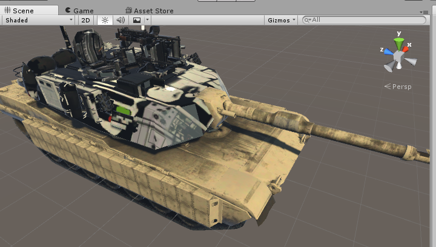

What may seem like the strangest decision is the mapping we chose for the Turret. You may have wondered why we didn't use Tex_0026_1, which would have mapped much better on the outside.  This is because this Model includes the inside of the tank -- in fact, we CHOSE this model because it includes an interior where we can seat our player -- and since our player will be seated inside the tank, we thought it was a higher priority for that area to look realistic than for the outside to look realistic.

Sometimes you are forced to make concessions when designing a product, and it's important to prioritize based on which choice will give you the most value.

Let's not stress about this though.

#Let's Look at our Tank in VR

>[action]
>Import SteamVR and drag in a Camera Rig. Don't forget to delete your Main Camera!

When you run the scene, it should look pretty nice! Now you see why we made the texture choice we did.

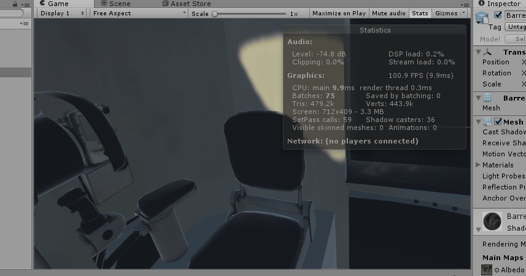

Our framerate is also pretty great; we're above 90 FPS (frames per second)! We opened the Stats panel by clicking "Stats" in the upper right of the Game View.

We recommend keeping the Stats panel open as often as you can bear to look at it, since it lists some pretty useful information like: FPS (framerate), batches (number of draw calls), Tris (number of triangles).

If your FPS count is low, you can try removing parts of meshes that are lower priority to include.

You can see how many triangles an individual mesh includes by selecting it in the hierarchy panel. The more tris, the more intensive it is to render, and the more of an impact it will have on your FPS.

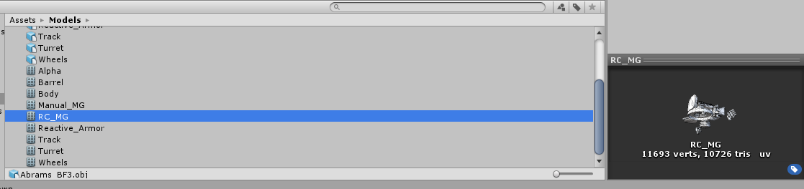

If your FPS is doing all right (like ours is now), there's no need to prematurely optimize. Instead, keep the option open of removing high-tri models.

Now let's finish up our Tank by making it a Prefab.

>[action]
>Create a Prefabs folder and drag the Tank in there.

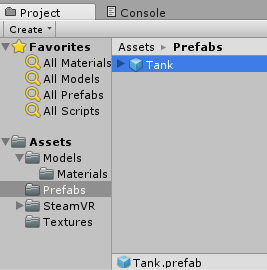

When we modify the Tank, we can Apply those changes back to the Prefab with the Apply button.

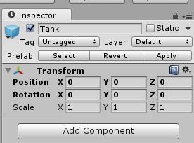

Congratulations! The tank is ready to use in the game. Now we are going to make a few changes to the inside of the tank.

Then we will drag the root of the GameObject to a new folder called
Prefabs. This will save the Prefab for us to use later:

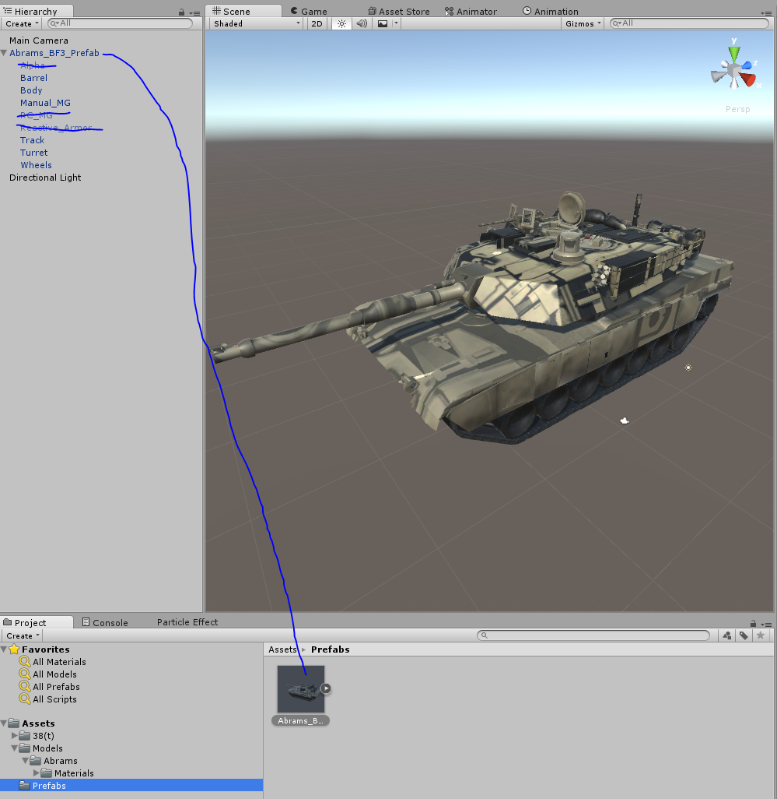

Congratulations! The tank is ready to use in the game. Now we are going
to make a few changes to the inside of the tank.
