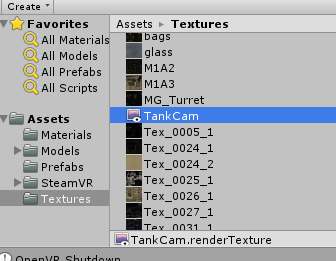
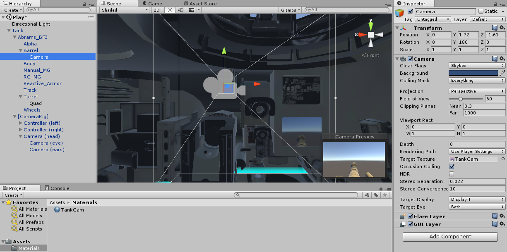
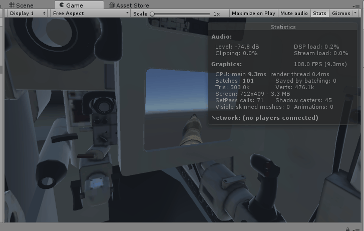
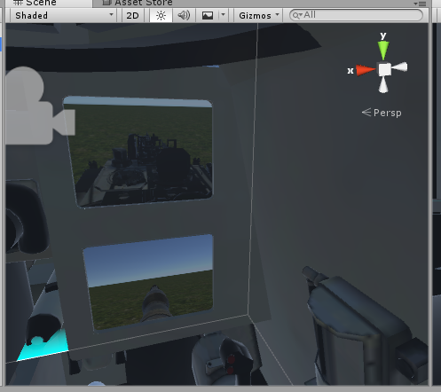

We want to set up our Tank game as a seated experience, not a room-scale one, since we don't want to encourage our players to run outside the Tank walls (trying to prevent the player from doing this at all might be a fun challenge for you at the end ;) )

> [action]
>
Parent the Camera Rig to the Tank and position it such that the player can sit comfortably in the chair closest to the monitors. You may choose to do this by placing a real chair in the physical world and positioning the Camera Rig based on that or by designing with the intention that the player sit on the ground. We positioned the Camera Rig at `(-0.49, 0.69, 0.86)` with a `rotation` of `(0,90,0)`, and, to encourage players to use the small space, set the `SteamVR_PlayArea` size to `200x150`.

Now we need to think of a way to see the world outside of the tank. Luckily, Unity has just the thing for us! They are called **Render Textures**. Render Textures are textures that can display what a camera sees. Perfect for this!

> [action]
>
Create a new Material called `TankCam` and a new `RenderTexture`, also called `TankCam`.
>

>
Now create a Camera and a Quad, with the quad parented to the Turret and the Camera parented to the Barrel. Position the Camera so that it can see over the Barrel and the Quad so that it sits inside one of the monitors. `Position (0,1.72,-1.61)` and `rotation (0,180,0)` worked nicely for our `Camera`, and `position (-0.797,1.22,0.311)`, `rotation (0,180,0)`, and `scale (0.35,0.35,0.35)` worked nicely for our `Quad`. Remove the Quad's Mesh Collider -- we won't need it, and it will give us an error if we choose to use a Rigidbody to move our Tank (unless we make it convex).
>
Now assign the RenderTexture you created as the Target Texture of the Camera you juts created and as the Albedo Texture of the Material you created, and assign the Material to the Quad. Be sure to remove the AudioListener from your new Camera!
>
You should now have a monitor in your Tank!

If what's going on is a little confusing, think of it in the following steps:

1. The Camera renders a Texture, which gets stored in the RenderTexture
1. The Material uses that RenderTexture as its main texture
1. The Quad is drawn using the Material, and so the image that shows up on it is the same as what the camera sees :)

> [action]
>
Now that we've made those changes, Apply the Prefab and save your Scene.

Now you can sit in your virtual tank with a camera that lets you look outside!

You may have noticed, by the way, that our number of Batches and Tris went up when you added the Camera. This is because each camera you add to your scene has to do its own rendering. That's actually one of the reasons VR is so sensitive: each eye has to be rendered as its own camera.

# Add another!

> [challenge]
>
Make a camera view that shows a view of the tank from behind to go in the upper monitor!
>

