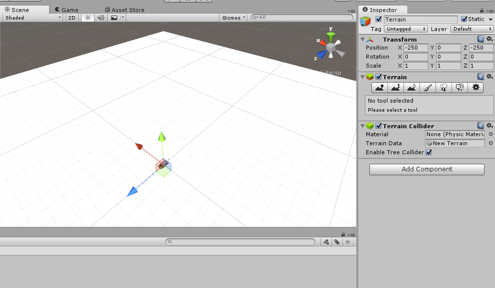
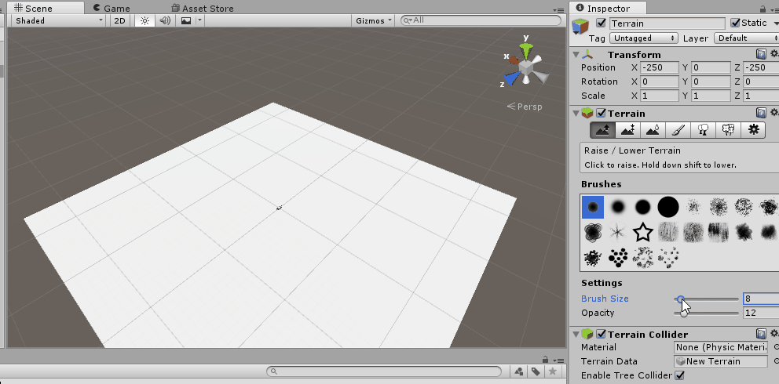
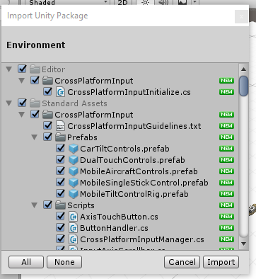
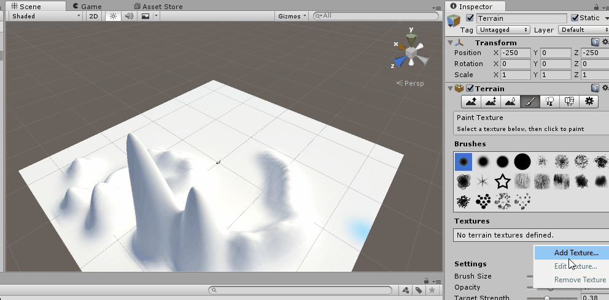
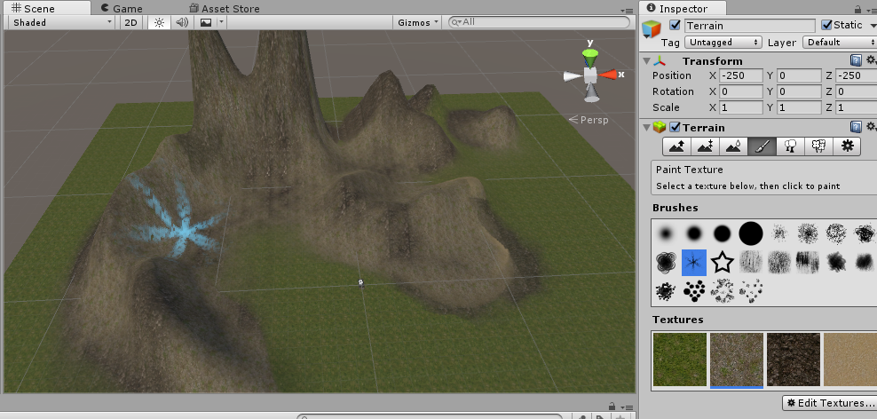
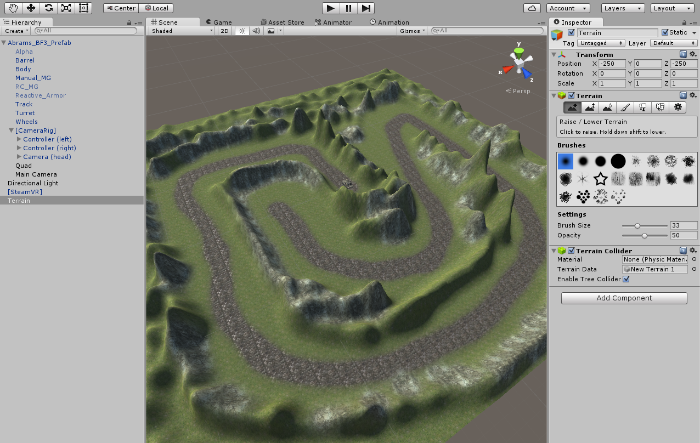

Let’s admit it, the outside is pretty dull right now. We can fix that. It is time to build the world.

>[action]Create a new Terrain (GameObject-&gt;3D Object-&gt;Terrain), position it at (-250,0,-250), and make sure the tank is at (0,0,0).

Terrain is a deformable and colorable mesh that can be used to create beautiful, organic-looking landscapes -- though they can become quite a burden to render quite quickly, so watch your Stats!

Honestly though, right now, this terrain is also kind of boring, but this is where we spice it up.

>[action]
>Select the raise height icon on the left, on the Terrain component, and click and drag to create some coooool looking mountains!

>[info]
>Terrain stores height in what's called a *heightmap*.  A heightmap is an array of numbers that represents the height at any given point. A lot of people find it handy to represent heightmaps with colors, which is where you get beautiful topological maps, like [that pretty one of Mars](http://www.lpi.usra.edu/science/treiman/greatdesert/workshop/marsmaps1/marsmaps1_imgs/mola_color_8.jpg)!

Once you have an area you like, it's time to give it some color. In order to add color, we first need to add Textures we can use to paint.

>[action]
>Import the Standard Asets Environment package (Assets-&gt;Import Package-&gt;Environment). We will be using Textures from this package.

>[action]
>Now add some Textures by selecting the paint brush icon, clicking Edit Textures-&gt;Add Texture..., and setting the Albedo Texture.  Some Textures we think you might like using are: CliffAlbedoSpecular, GrassHillAlbedo, GrassRockyAlbedo, MudRockyAlbedoSpecular, and SandAlbedo.

We can then use these textures to paint the terrain the same way we raised the height, by clicking and dragging.

>[action]
>Go ahead and paint up your masterpiece of mountains! Feel free to paint and play and build a nice little compelling environment for your tank :)

Here are some ideas to get you going.

Masterful work!

Now it's time to make the Tank move.
