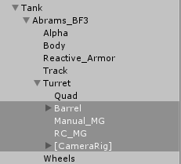
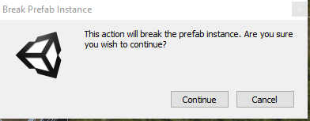
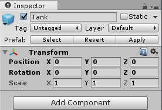
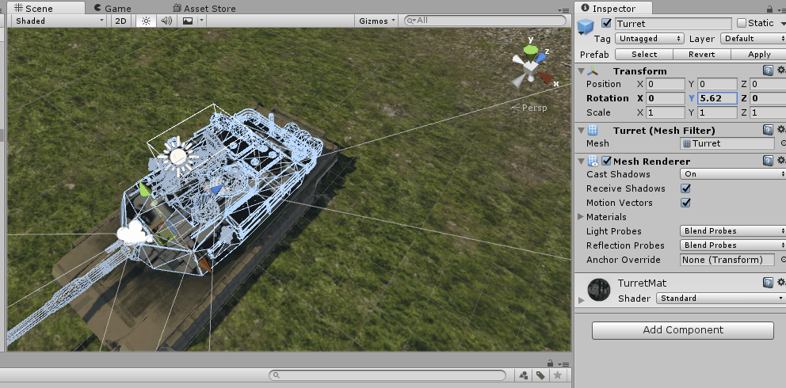
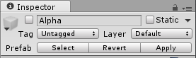
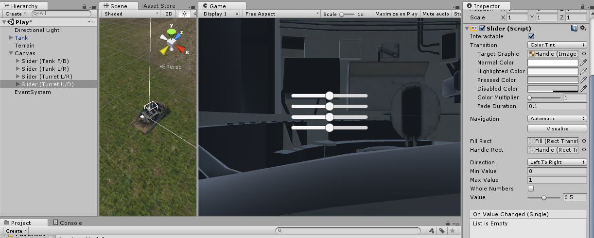
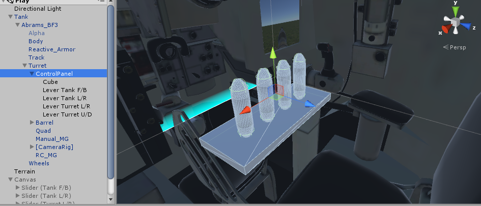
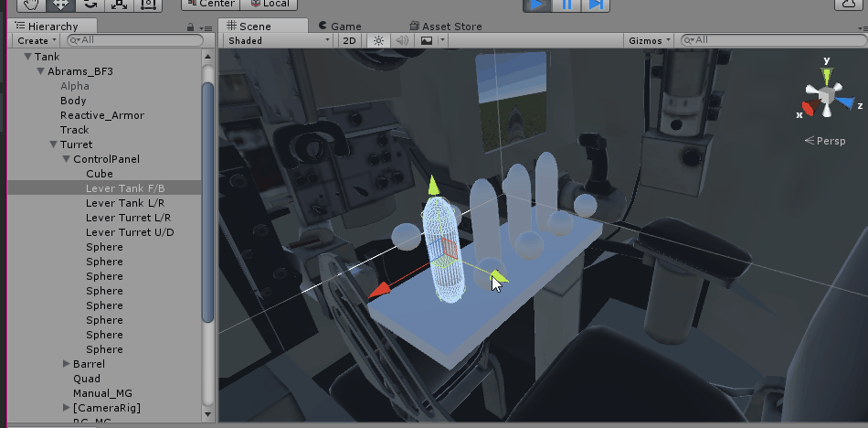
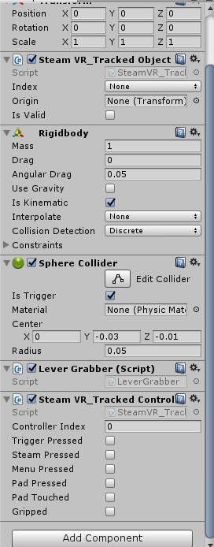
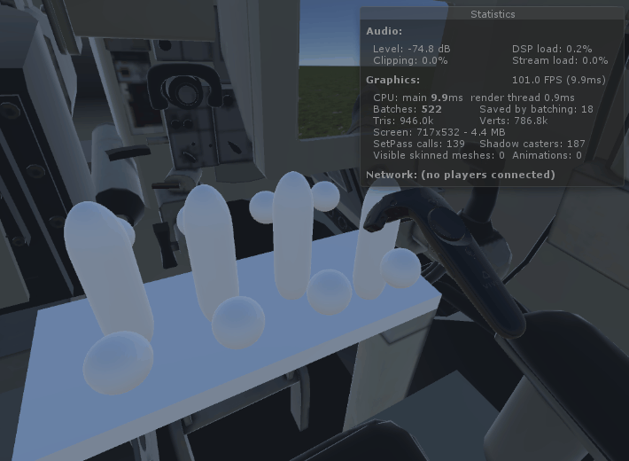

In prep for Tank movement, we're going to rearrange the structure of the Tank itself.

>[action]
>Parent Barrel, [CameraRig], Manual_MG, and RC_MG to the Turret.



When you do this, you'll be prompted with a warning that tells you rearranging the structure of the Prefab will break the connection of that object to the Prefab itself.



This is both okay and expected. Just click the "Apply" button to apply the changes you just made to the Prefab, and then the connection will come back.



Now that everything on the Turret is parented to the Turret, when you rotate it around, everything should move with it.



You may have noticed, however, that the Alpha object is a problem... It has some pieces that visually look like they should have been part of the Turret, and some other pieces that look like they should have been a part of the Body.

We could resolve this issue by splitting up the model in Blender, but since Alpha isn't very significant to making our Tank look like a Tank, we're going to opt for an easier and quicker solution.

>[action]
>Disable Alpha.



Now let's make our Tank move!

We want to give it the following movement options:
1. move forward or backwards
1. turn left or right
1. aim turret left or right
1. aim turret up or down

Eventually, we'll want to make these controlled by levels the player can pull, but let's take this one step at a time.  Let's mock it quickly with a UI that the player will ultimately never interact with, but that we can use for testing.

>[action]
>Create a Canvas a UI Slider for each control. These will represent our levers. Don't spend too much time on this -- by no means does it need to look pretty -- but do be sure to label each slider clearly and to set their default values to 0.5.

To help with testing, we've also split our views so that we can move the Sliders in the Game View while watching the Tank in the Scene View. We've hidden Stats because we aren't concerned with them right now and they cover part of our UI when they're on.



>[action]
Now write code to make the Sliders control the Tank.
>
The specs should be as follows:
- The Tank F/B Slider should make the Tank go forwards when on the right, back when on the left, and not at all when in the center. Bonus points if it moves faster the farther it is on either end.
- The Tank L/R Slider should make the Tank turn right when on the right, left when on the left, and not at all when in the center. Bonus points if it turns faster the farther it is on either end.
- The Turret L/R Slider should make the Turret aim to exactly 180 degrees about the up axis when all the way on the right, to exactly -180 degrees about the up axis when all the way on the left, and to exactly 0 degrees about the up axis when in the center.
- The Turret U/D Slider should make the Turret aim to exactly 11 degrees about the right axis when all the way on the right, to exactly -11 degrees about the right axis when all the way on the left, and to exactly 0 degrees about the right axis when in the center.
>
You may find it helpful to write two separate scripts: one on the Tank, named, say "Tank," that has public methods on it that are responsible for moving it; and one on the UI, named, say "TankControllerDebug," that is responsible for reading the Slider values and calling the Tank methods as appropriate.
>
You may also find it helpful to know that Slider values range between 0 and 1; 1 being on the far right, and 0 being on the far left.

This is a LOT to do at once, so be sure to break it down into small, easily testable steps! Start with the control that sounds easiest to you first!


>[solution]
>
>We did this by writing two components, one called "Tank," which we attached to the Tank, and one called "TankControllerDebug," which we attached to the Canvas.
>
Tank looked like this:
>
```
using UnityEngine;
using System.Collections;
>
[RequireComponent(typeof(Rigidbody))]
public class Tank : MonoBehaviour {
>
    public float tankMovementSpeed;
    public float tankRotationSpeed;
    public float turretPitchBound;
    public float turretYawBound;
>
    public Transform turret;
    private Rigidbody rb;
>
	// Use this for initialization
	void Start () {
        rb = GetComponent<Rigidbody>();
	}
>
    public void Move(float intensity)
    {
        rb.velocity = transform.forward * ClampedIntensity(intensity) * tankMovementSpeed;
    }
>
    public void Turn(float intensity)
    {
        rb.angularVelocity = transform.up * ClampedIntensity(intensity) * tankRotationSpeed;
    }
>
    public void TurnTurret(float intensityX, float intensityY)
    {
        turret.localRotation = Quaternion.Euler(
            ClampedIntensity(intensityX) * turretPitchBound,
            ClampedIntensity(intensityY) * turretYawBound,
            0
        );
    }
>
    private float ClampedIntensity(float intensity)
    {
        return Mathf.Clamp(intensity, -1f, 1f);
    }
}
>
```
>
and TankControllerDebug looked like this:
>
```
using UnityEngine;
using System.Collections;
using UnityEngine.UI;
>
public class TankControllerDebug : MonoBehaviour {
>
    public Slider sliderMoveFB;
    public Slider sliderTurnLR;
    public Slider sliderTurretLR;
    public Slider sliderTurretUD;
>
    public Tank tank;
>
	// Update is called once per frame
	void Update () {
>
        tank.Move(GetIntensity(sliderMoveFB));
        tank.Turn(GetIntensity(sliderTurnLR));
        tank.TurnTurret(GetIntensity(sliderTurretUD), GetIntensity(sliderTurretLR));
>
	}
>
    private float GetIntensity(Slider slider)
    {
        return Mathf.Lerp(-1,1,slider.value);
    }
}
```
>
We dragged the expected objects into the slots we created by declaring public variables -- Tank into the TankControllerDebug's Tank slot; all the Sliders into the slots of the same names; Turret into the Tank's Turret slot -- and set the Tank's TankMovementSpeed to 5, TankRotationSpeed to 5, TurretPitchBound to 11, and TurretYawBound to 180 (though you may find better values through testing!).
>
We chose to use physics to move our Tank, because, in conjunction with a Collider, this means that we get collisions with the mountains for free :) Just be sure to lift the tank out of the ground (if your Terrain is at height 0, likely your Tank is embedded in it).
>
Because we wanted our inputs to our functions to be between -1 and 1 rather than between 0 and 1, like the outputs of Sliders, we used Mathf.Lerp in a helper function in our TankControllerDebug.
>
Lerp is a function that returns a value at some percentage between a min and a max, so for example Mathf.Lerp(0,100,0.5) woudl return 50, because 50 is 0.5 of the way between 0 and 100. You might say, "Wow. that’s stupid. I can just do math and say 0.5 \* 100 = 50." This is true, but when you're not bounded on the bottom by 0, your math would look like this:
>
```
float lerpedValue = minValue + (maxValue - minValue) * percentage;
```
>
and writing that every time could be a pain. Using Lerp saves you the trouble. Unity also has other Lerp functions you can access for other types of linear interpolation: Color.Lerp and Vector3.Lerp to name a few -- they all return values that are the specified percentage between the min and max you specified.

All right, now it's lever time!

#Lever Time

>[action]
>Make a set of 4 levers out of primitives like Cubes, and position the set of levers in front of the seat you expect our player to use.



We want to be able to pull on these levers and have them move forwards and backwards, but no other directions, and to be bounded -- basically, we're trying to simulate them being in slats that constrain their motion.

In order to do this, we're going to write a script, and we're also going to make it give us some visual feedback.

>[action]
>Create a component named "TankController," attach it to your Control Panel, and give it the following definition:
>
```
using UnityEngine;
using System.Collections;
using System.Collections.Generic;
>
public class TankController : MonoBehaviour {
>
    public float leverBound;
>
    public Transform leverMoveFB;
    public Transform leverTurnLR;
    public Transform leverTurretLR;
    public Transform leverTurretUD;
>
    private Transform[] levers;
>
	// Use this for initialization
	void Start () {
>
        List<Transform> leversMut = new List<Transform>();
>
        leversMut.Add(leverMoveFB);
        leversMut.Add(leverTurnLR);
        leversMut.Add(leverTurretLR);
        leversMut.Add(leverTurretUD);
>
        levers = leversMut.ToArray();
>
        foreach (Transform lever in levers)
        {
            CreateIndicator(lever.position + lever.forward * leverBound);
            CreateIndicator(lever.position - lever.forward * leverBound);
        }
	}
>
    private void CreateIndicator(Vector3 position)
    {
        GameObject go = GameObject.CreatePrimitive(PrimitiveType.Sphere);
        go.transform.localScale = Vector3.one * 0.05f;
        go.transform.position = position;
        go.transform.SetParent(transform);

    }
>
	// Update is called once per frame
	void Update () {
>
        foreach (Transform lever in levers)
        {
            Vector3 localPosition = lever.localPosition;
            localPosition.z = Mathf.Clamp(localPosition.z, -leverBound, leverBound);
            lever.localPosition = localPosition;
        }
	}
}
```
>
Then add the levers to the slots.

When you run the Scene and try to drag the levers past the bounds, they should stop at the spheres :)



Now let's make the levers grabbable by our controllers when we press the Trigger.

>[action]
>Create the following component, and then add it to each hand:
>
```
using UnityEngine;
using System.Collections;
using System.Collections.Generic;
using System.Linq;
>
[RequireComponent(typeof(SteamVR_TrackedController))]
public class LeverGrabber : MonoBehaviour {
>
    private SteamVR_TrackedController controller;
    private HashSet<Transform> leversInReach = new HashSet<Transform>();
    private List<Transform> leversGrabbed = new List<Transform>();
>
	// Use this for initialization
	void Start () {
        controller = GetComponent<SteamVR_TrackedController>();

        controller.TriggerClicked += Controller_TriggerClicked;
        controller.TriggerUnclicked += Controller_TriggerUnclicked;
	}
>
    private void Controller_TriggerClicked(object sender, ClickedEventArgs e)
    {
        leversGrabbed = leversInReach.ToList();
    }
>
    private void Controller_TriggerUnclicked(object sender, ClickedEventArgs e)
    {
        leversGrabbed.Clear();
    }
>
    void OnTriggerEnter(Collider col)
    {
        if (col.gameObject.CompareTag("Lever"))
        {
            leversInReach.Add(col.transform);
        }
    }
>
    void OnTriggerExit(Collider col)
    {
        if (col.gameObject.CompareTag("Lever"))
        {
            leversInReach.Remove(col.transform);
        }
    }
>
    public Transform[] GetLeversGrabbed()
    {
        return leversGrabbed.ToArray();
    }
}
```
>
and add a Sphere Collider to your controller, sized and positioned so that it's at the edge, and set Is Trigger to true. Also add a Rigidbody with Use Gravity set to false and Is Kinematic set to true.



>[action]
>Then modify your TankController component to look like the following:
>
```
using UnityEngine;
using System.Collections;
using System.Collections.Generic;
>
public class TankController : MonoBehaviour {
>
    public Tank tank;
    public LeverGrabber[] grabbers;
>
    public float leverBound;
>
    public Transform leverMoveFB;
    public Transform leverTurnLR;
    public Transform leverTurretLR;
    public Transform leverTurretUD;
>
    private Transform[] levers;
>
    // Use this for initialization
    void Start()
    {
>
        List<Transform> leversMut = new List<Transform>();
>
        leversMut.Add(leverMoveFB);
        leversMut.Add(leverTurnLR);
        leversMut.Add(leverTurretLR);
        leversMut.Add(leverTurretUD);
>
        levers = leversMut.ToArray();
>
        foreach (Transform lever in levers)
        {
            CreateIndicator(lever.position + lever.forward * leverBound);
            CreateIndicator(lever.position - lever.forward * leverBound);
        }
    }
>
    private void CreateIndicator(Vector3 position)
    {
        GameObject go = GameObject.CreatePrimitive(PrimitiveType.Sphere);
        go.transform.localScale = Vector3.one * 0.05f;
        go.transform.position = position;
        go.transform.SetParent(transform);
    }
>
	// Update is called once per frame
	void Update () {
>
        foreach (LeverGrabber grabber in grabbers)
        {
            Transform[] leversGrabbed = grabber.GetLeversGrabbed();
>
            foreach (Transform lever in leversGrabbed)
            {
                Vector3 leverLocalPositionOld = lever.localPosition;
                lever.position = grabber.transform.position;
                Vector3 leverLocalPositionNew = lever.localPosition;
>
                leverLocalPositionNew.z = Mathf.Clamp(lever.localPosition.z, -leverBound, leverBound);
                leverLocalPositionNew.x = leverLocalPositionOld.x;
                leverLocalPositionNew.y = leverLocalPositionOld.y;

                lever.localPosition = leverLocalPositionNew;
            }
        }
	}
>
    private float GetLeverIntensity(Transform lever)
    {
        return lever.localPosition.z / leverBound;
    }
}
```
>
>and add your controllers to the array of LeverGrabbers in the editor (expand with the arrow, enter "2," hit "Enter," and then drag as usual into the slots).

<!-- -->

>[action]
>Tag your levers with the tag "Lever" before you run the Scene!

Then when you run it...

Presto!



Now all that's left to do is read values from our levers and transmit those to the Tank ;) Think you're up for it?

>[action]
>Make the levers control the Tank! A good first step if you don't know where to start is to output values for the levers between -1 and 1, like we did for the Sliders. Then you can just use the same logic that the Sliders used.

<!-- -->

>[solution]
>
We did this by adding the following to the end of TankController's Update method:
>
```
tank.Move(GetLeverIntensity(leverMoveFB));
tank.Turn(GetLeverIntensity(leverTurnLR));
tank.TurnTurret(GetLeverIntensity(leverTurretUD), GetLeverIntensity(leverTurretLR));
```
>
where GetLeverIntensity is a new function we defined as such:
>
```
private float GetLeverIntensity(Transform lever)
{
    return lever.localPosition.z / leverBound;
}
```
