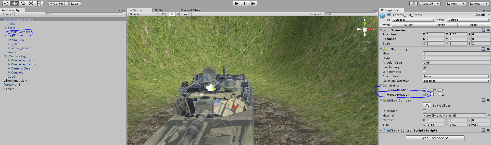
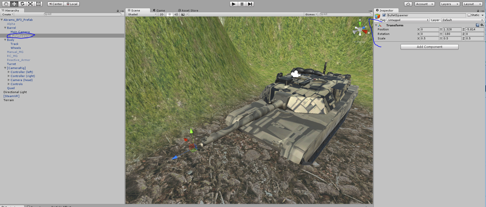
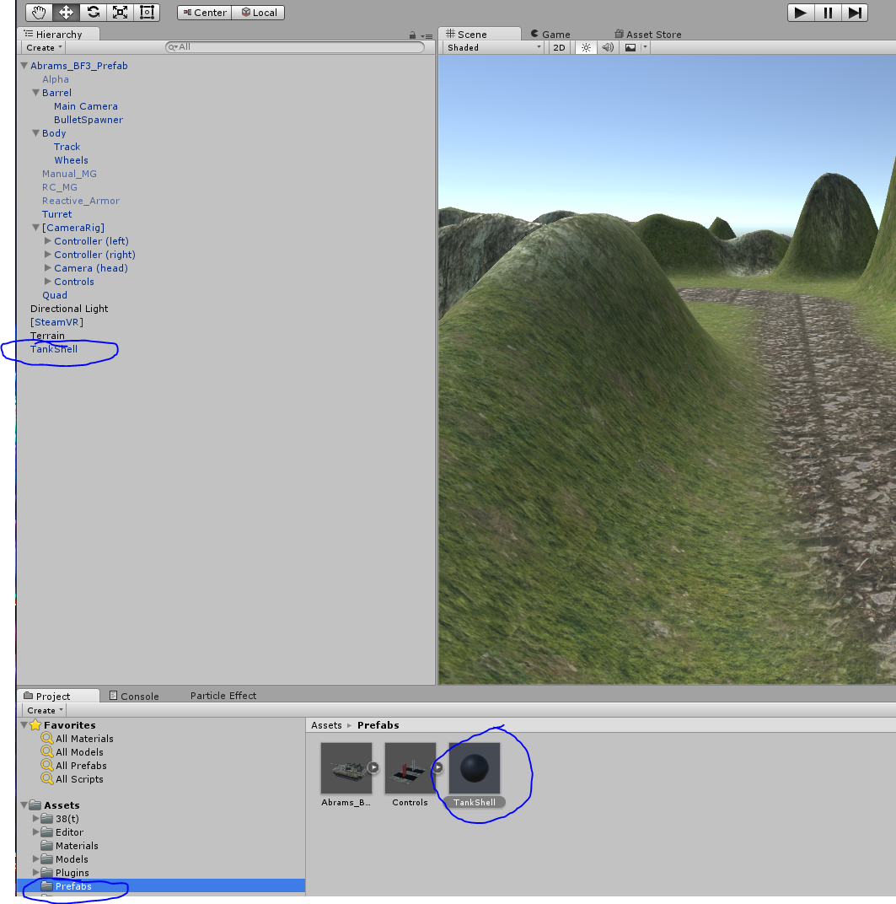
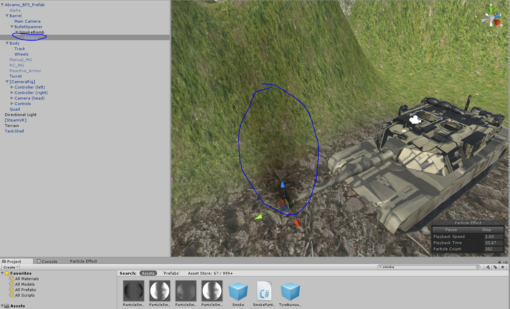
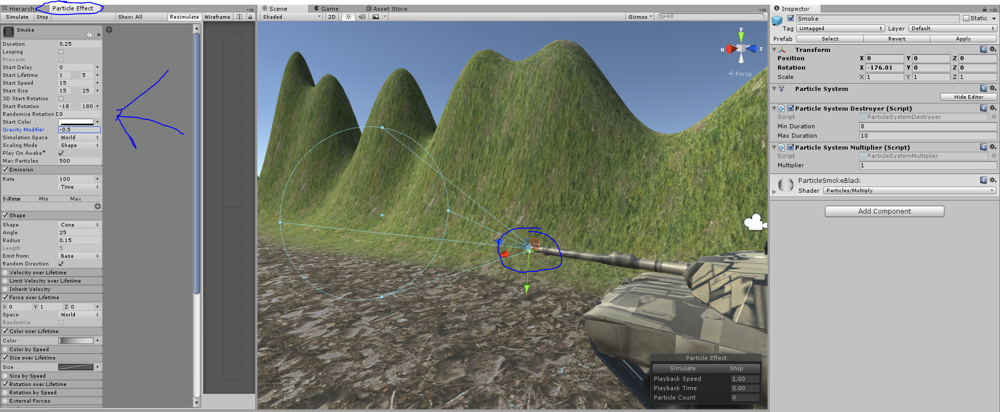

LERP is very important, it allows you to find a value between two ranges
based on another value between 0 and 1.

So for example, if I have a slider and it’s value is 0 to 1, and I want
to map it to a number between 1 and 100 I can use LERP and it will
translate 0.5 into 50. You might say, wow that’s stupid, I can just use
percentages for that and multiply 0.5 \* 100 = 50.

Well, that is true, but that only works when you are doing 1 out of 100.

Of course you can also divide to give you a percentage when you have a
number along a range like 32 / 192 = 0.16666, so we know that 32 is
16.66% of 192. But again that is assuming you are dealing with the range
of 0 to 192. If you are dealing with 30 - 192, 32 is no longer 16% of
the total, and if you want to find out what number is 16% of the way
along of 30-192 you use LERP.

What makes LERP really powerful is when you LERP very weird number
ranges like -45 and 30. 0.5 will still find the midway point between
those two numbers. 0.25 will find the ¼ point between those numbers.
This helps us figure out exact rotation amounts based on the lever
locations in the cockpit.

Unity has a very nice helper function for this called
Mathf.LERP(minRange, maxRange, percentage (0-1));

Finally there is method here to fire the cannon, it’s pretty
straightforward, it makes some smoke and a cannonball and honors reload
time.

Now we need to attach the Main Camera to the barrel, so that when we
look with the barrel the camera will follow it. We should also lock the
X coordinate and Z rotation and the Y position of the rigid body so that
the tank won’t climb the mountains. The reason for this is the tank will
move along its forward vector, so if it tilts upward it will start
climbing into the sky. There are ways to fix this, but for this game it
is acceptable to just lock the rotation and position of the Rigidbody.

You can see all of these settings below:

Also add a Bullet Spawner to the front of the tank barrel. This will be
the location that the bullet, smoke, and fire will be spawned when we
shoot the cannon. Use this image as a reference of where to put it. Also
make sure it is rotated correctly so we can use its Vector3.forward
property to determine the angle to launch the bullet.

Now we can get to the fun stuff. Let’s make our first tank bullet.
Create a new Sphere and call it TankShell. Then create a TankShell
Material in our Materials folder. Drag it to the tank shell, paint it
black, and drag the shell to our prefabs folder:

We can now create a particle system to spray smoke out when the cannon
goes off, and when the shell lands.

So import the standard ParticleSystems package from Unity under the
Assets menu.

Now you can attach Smoke to our BulletSpawner so we can see how it will
appear when it spawns at the front of the tank during a shot. Obviously
this smoke prefab isn’t right for us, but we can change it to do exactly
what we want...Let’s do that now.

Click the smoke particle system then click Open Editor to view the
particle editor, this will let you simulate and stop the effect and test
it. Copy the settings you see on the left panel. A particle system lets
you spawn hundreds of tiny textures that blend with the environment for
a cheap cost. You can control the behavior of these tiny instances over
time. We want the duration to be short, this is an explosion from a gun,
so set the Duration to 0.25. Make sure Looping is off, this is a one
shot kind of thing.

We want the smoke to linger so set the Start Lifetime to 1 to 5, this
means each particle has a random lifetime of beween 1 and 5 seconds.

Start Speed will be 15, this will make the smoke propel forward at a
fast speed from the front of the cannon.

Start Size should be 15 to 25, this will control the scale of each
smokelet.

The Rotation is fine -18 to 180 this will control how the particles
rotate as they are emitted.

Gravity Modifier will control how gravity affects the particles. Smoke
rises, so we want to add a slight -0.5 modifier to make it slowly rise
into the air.

Simulation Space World means that the smoke will exist in the world,
this is important because if we make the smoke a child of the tank we
still want the smoke to float in the world and not follow the tank
around.

Max particles 500 is fine, that is the maximum this engine can spawn.

Emission should be 100, we want 100 quick particles when the system is
created.

Shape should be Cone, we can then rotate the cone to come out of the
front of the cannon and the smoke will fly forward as expected.

You will need to adjust Color over Lifetime. This property controls how
opaque or transparent the smoke will be, and if it is tinted. The
standard black tint is fine, but adjust the alpha settings so the smoke
stays solid for longer.

That should be it. Now when you press Simulate at the top the smoke
explosion effect will look quite realistic.

Now drag your SmokeEffect to your Prefabs folder so we can create it
whenever we want.

Now for the Bullet, let’s make a bullet and a bullet script. Go back to
TankShell and create a script on it called BulletShell.

This script will be really simple:

~~~
using UnityEngine;
using System.Collections;

public class BulletShell : MonoBehaviour {
    public GameObject ExplosionPrefab;
    void OnTriggerEnter(Collider c)
    {
        c.gameObject.SendMessage("BulletHit", SendMessageOptions.DontRequireReceiver);
        Destroy((GameObject)Instantiate(ExplosionPrefab, this.transform.position, Quaternion.identity), 7f);
        Destroy(this.gameObject);
    }
}
~~~

We are waiting for a collision of any kind, when the bullet collides
with anything it will destroy itself, spawn an explosion, and send a
message to that object called BulletHit. The object it sends the message
to will decide what to do with BulletHit. This is good design, because
the bullet is doing it’s job beautifully, but it is not deciding how to
affect anyone else, it is simply letting them know if it hits them. Now
when we make enemy tanks all we need to do is give them a BulletHit
method, and whenever they get hit by a bullet we can make them get hurt
or die.

As you can see we also bind a public variable

**public GameObject ExplosionPrefab;**

ExplosionPrefab is the prefab we want to spawn when the bullet explodes.
Note how we Instantiate this prefab:

Destroy((GameObject)Instantiate(ExplosionPrefab,
this.transform.position, Quaternion.identity), 7f);

It looks like a lot of stuff, but it is simple: Destroy() tells the
object to be destroyed (at the end there you can see 7f, which means
after 7 seconds). This ensures the particle system gets cleaned up after
it’s done.

(GameObject)Instantiate is a cast of the result of Instantiate to
GameObject.

Then we decide what we want to instantiate, which is ExplosionPrefab,
and we want to put it right where the bullet is at a 0,0,0 rotation
(Quaternion.identity)
