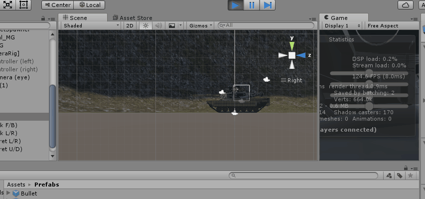
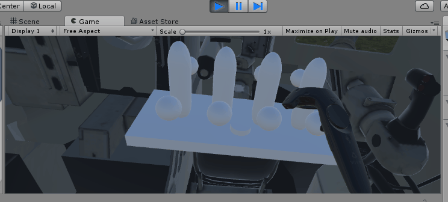
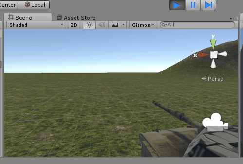
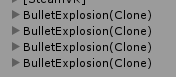
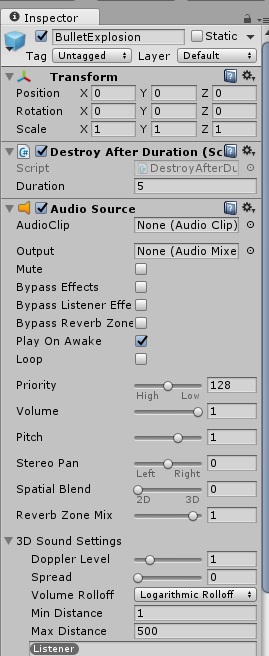
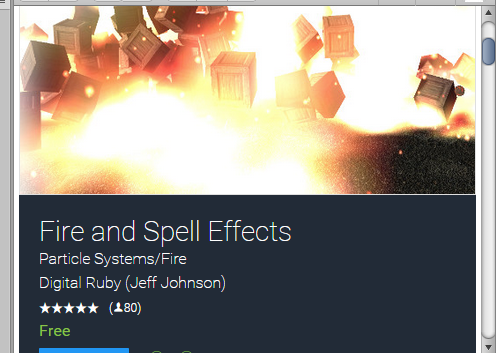
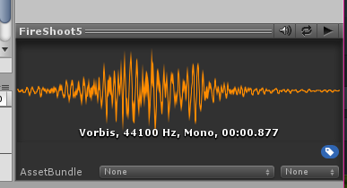
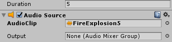
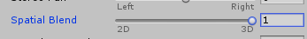

Let's add a button to launch bullets out of our Turret!

We should be able to do this in a very similar way to how we implemented the lever controls; have a function in Tank that is responsible for firing the bullet, and a function in a Controller component elsewhere that is responsible for calling that Tank function.

Like the lever controls, we're going to start with something simple, like UI to test before we figure out the actual inputs we're going to use for the game.

>[action]
>Go ahead and write a function that launches a bullet from the front of your Barrel. For now, make it controlled by a key press on our keyboard. In order to do this, you will likely need to create a Bullet Prefab that you can instantiate at some spawn point at the tip of your Barrel.



>[solution]
>
>We did this by adding the following to TankControllerDebug's Update method:
>
```
if (Input.GetKeyDown(launchKey))
{
  tank.LaunchBullet();
}
```
>
where launchKey is a public variable we defined in the class as well, of type KeyCode.
>
We then added the following method to Tank:
>
```
public void LaunchBullet()
{
    GameObject go = (GameObject)Instantiate(bulletPrefab, bulletSpawner.position, bulletSpawner.rotation);
    Bullet bullet = go.GetComponent<Bullet>();
    bullet.Launch(bulletSpawner.forward * launchPower);
}
```
and added the following member variables:
>
```
public Transform bulletSpawner;
public GameObject bulletPrefab;
public float launchPower;
```
>
We set launchPower to 10, connected bulletSpawner to an Empty Game Object parented to the Barrel and positioned at the tip with the blue arrow facing away from it, and we created our Bullet Prefab as an Empty Game Object with the a scaled down Sphere as the child and a new component we called Bullet attached to it:
>
```
using UnityEngine;
using System.Collections;
>
[RequireComponent(typeof(Rigidbody))]
public class Bullet : MonoBehaviour {
>
    private Rigidbody rb;
>
	// Use this for initialization
	void Awake () {
        rb = GetComponent<Rigidbody>();
	}
>
    public void Launch(Vector3 force)
    {
        rb.AddForce(force,ForceMode.Impulse);
    }
}
```
>
>Bullet uses the Awake method to set rb instead of the Start method, because we call Launch immediately after the Prefab is instantiated, and Start won't get called until the first frame the object is alive.

Now we just need to create a button on our Control Panel that tells the Tank to fire when pressed.

>[action]
>Make a button on the Control Panel to replace our keyboard input.



>[solution]
>
>We did this by adding a scaled Cylinder to our Control Panel with its Cylinder Collider set to be a trigger, a kinematic non-gravity-using Rigidbody attached to it and the following component attached:
>
```
using UnityEngine;
using System.Collections;
>
public class TankLaunchButton : MonoBehaviour {
>
    public Tank tank;
>
    void OnTriggerEnter(Collider col)
    {
        if (col.gameObject.CompareTag("Controller"))
        {
            tank.LaunchBullet();
        }
    }
}
```
>
We tagged both our controllers with a new "Controller" tag.

#Making the Bullets more Bullet-like

It's great and all that we can launch bullets, but right now they're kinda sad. They hit the ground and just roll away all apathetic-like. We want them to explode!

There are some pretty neat particle effects that would work great for this in the Standard Assets, or you could make your own ;)

>[action]
>Make the Bullets EXPLODE in bursts of fire-y goodness when they hit the ground.



>[solution]
>
We got our ParticleSystems from the Standard Assets.
>
We parented a Smoke system to our Bullet Prefab with a few modifications, and then added the following code to our Bullet component:
>
```
void OnCollisionEnter(Collision col)
{
    Instantiate(explosionPrefab, transform.position, transform.rotation);
    Destroy(gameObject);
}
```
>
where explosionPrefab is a public GameObject set to a new Prefab we defined with the Explosion from the StandardAssets as a child.
>
You may have noticed, by the way, that the smoke trail we created vanishes immediately when the Bullet hits the ground. This is because it gets destroyed when its parent, the bullet, is destroyed. If you implemented smoke like this and wanted to fix this, you may enjoy trying to fix that at the end of the tutorial ;). As a hint, you may consider making an object with smoke that follows the bullet, rather than one that is parented to it.

If you implemented the explosion the way we did, you may have noticed that those explosions never quite go away :/



>[action]
>Add a component to the explosion that destroys them after a certain period of time.

<!-- -->

>[solution]
>
>We decided to do this via a Coroutine. Our component looks like this:
>
```
using UnityEngine;
using System.Collections;
>
public class DestroyAfterDuration : MonoBehaviour {
>
    public float duration;
>
	// Use this for initialization
	void Start () {
        Destroy(gameObject, duration);
	}
}
```
>
This version of the Destroy method will destroy an object after a certain delay, which we can specify to be whatever we'd like ;)

#Make it Go Boom

As a final bullet step, let's add a sound effect to our explosion!

>[action]
>Add an AudioSource component to your BulletExplosion (or whatever you named yours) Prefab.



An AudioSource is a component that can play an AudioClip either automatically or via a method in code. Let's get a clip we can use to try it out. We can get some great sounds from the Unity Asset Store.

>[action]
>Download Fire and Spell Effects.



You can preview audio by selected an AudioClip (located in PyroParticles/Prefabs/Audio), and clicking the play button in the bottom right. You may need to restart Unity if you didn't initially have an audio device plugged into your machine.



>[action]
>Then drag PyroParticles/Prefabs/Audio/FireExplosion5 into your AudioSource's AudioClip slot.



By default, our Audio Source is set to Play On Awake. This means that, when the object is initialized, the sound will play. This is exactly what we want :)

>[action]
Go ahead and try it out!

You should hear each explosion that happens!

There is one more very important thing we should do to our audio though. We should make it 3D audio!

Now, what does this mean exactly, 3D audio? 3D audio gets quieter the farther you are away from it. Unity gives you lots of control over just how exactly the sound should die off as you step away from the source, but we'll just be happy with the defaults.

>[action]
>Move the AudioSource's Spatial Blend slider from 2D to 3D, and...Viola! 3D Audio :)



You can hear the difference by firing bullets at nearby walls vs far-off ground.

>[action]
>Now go ahead and try implementing another 3D sound in your scene. Give the button press a sound, or the levers a looping sound when they move! Audio can really bring a VR experience that next step forward in terms of immersion!
