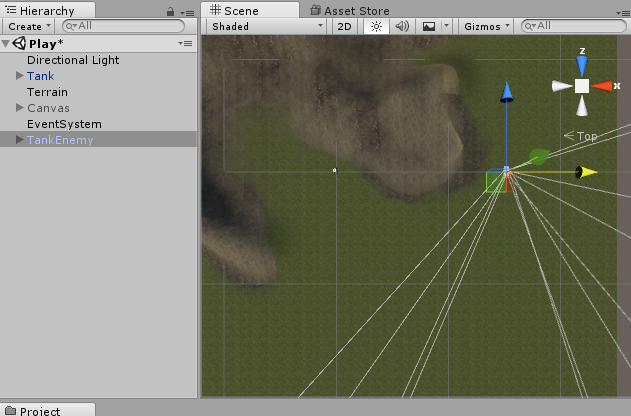
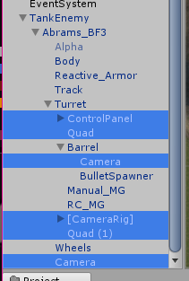
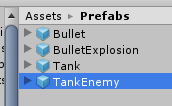
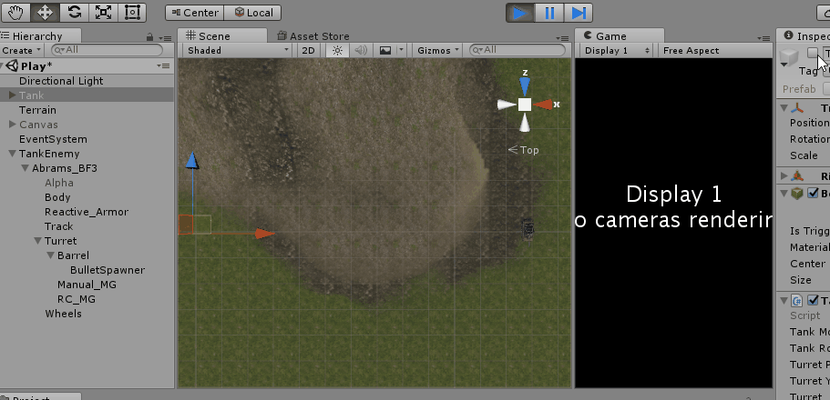

As the final step for our game, we're going to add some Enemy Tanks, controlled by the computer. We're going to be writing our own Artificial Intelligence!

If the idea of writing your own artificial intelligence, or AI, sounds scary, don't worry! It's just a fancy term for "rules that a thing follows." You've already done this tons of times. We're just going to do it in a slightly fancier way, using something called a state machine switch which state the enemy is in, and then have it act certain ways depending on what state it's in.

To keep things simple, we're going to give our Tank the following states:

- **Waiting** - in this state, the tank will just wait.
- **Aiming** - in this state, the tank will aim its turret at the player
- **Firing** - in this state, the tank will fire repeatedly (with a delay) at the player

The enemy will be in Waiting state until it can see the player, at which point it will aim, and then fire repeatedly. If the enemy ever loses sight of the player, it will go back to the waiting state.

To begin, we'll need a base tank. Fairly conveniently, we already have one ;).

>[action]
>Drag out another Tank Prefab, and name it "TankEnemy," and drag it somewhere not near the player (or simply disable the player).



Because we've made our Tank component pretty general, we can totally still use it! There's some other stuff on the tank that we won't want though.

>[action]
>Go ahead and delete the following from TankEnemy's hierarchy:
- the ControlPanel
- both internal Cameras that draw to the screens
- both Quads that are acting as screens
- the Camera Rig



>[action]
>When the Prefab connection is broken, this time, rather than hitting the "Apply" button, drag TankEnemy down to your Prefabs folder to make a *new* Prefab for the enemy tank.



Now it's time to make a new component to control our enemy! You're welcome to try on your own first, but we've provided a simple (but limited and flawed) AI that you can use to get the idea of how one might work.

>[action]
>Create a new component called TankEnemyController with the following definition, and add it to the TankEnemy Prefab:
>
```
using UnityEngine;
using System.Collections;
>
[RequireComponent(typeof(Tank))]
public class TankEnemyController : MonoBehaviour {
>
    public float attackCooldownDelay = 1f;
    private bool isAttackHot;
>
    public Transform player;
    public Transform bulletSpawner;
    public float turretTurnRate = 0.1f;
>
    private Tank tank;
>
    private enum State
    {
        Waiting,
        Aiming,
        Attacking,
    }
    private State state;
>
	// Use this for initialization
	void Start () {
        tank = GetComponent<Tank>();
	}
>
	// Update is called once per frame
	void Update () {
>
        Vector3 toPlayer = player.position - transform.position;
        bool canSeePlayer = false;
        RaycastHit hitPlayerAny;
        if (Physics.Raycast(transform.position,toPlayer,out hitPlayerAny)) {
            canSeePlayer = hitPlayerAny.transform.Equals(player);
        }
>
        bool canHitPlayer = false;
        RaycastHit hitPlayerAimed;
        if (Physics.Raycast(bulletSpawner.position,bulletSpawner.forward, out hitPlayerAimed))
        {
            canHitPlayer = hitPlayerAimed.transform.Equals(player);
        }
>
        if (canSeePlayer && !isAttackHot)
        {
            if (canHitPlayer)
            {
                state = State.Attacking;
            } else
            {
                state = State.Aiming;
            }
        } else
        {
            state = State.Waiting;
        }
>
        switch (state)
        {
            case State.Waiting:
                {
                    // do nothing
                    break;
                }
            case State.Aiming:
                {
                    float turretTurnPeriod = turretTurnRate == 0 ? 0 : 1 / turretTurnRate;
                    float percentage = turretTurnPeriod == 0 ? 0 : (Time.time % turretTurnPeriod) / turretTurnPeriod;
                    float intensity = Mathf.Sin(2.0f * Mathf.PI * percentage);
                    tank.TurnTurret(0, intensity);
                    break;
                }
            case State.Attacking:
                {
                    if (!isAttackHot)
                    {
                        StartCoroutine(LaunchBullet());
                    }
>  
                    break;
                }
        }
	}
>
    private IEnumerator LaunchBullet()
    {
        tank.LaunchBullet();
        isAttackHot = true;
        yield return new WaitForSeconds(attackCooldownDelay);
        isAttackHot = false;
    }
}
```
>
>and then add the Tank to the Player slot and the TankEnemy's BulletSpawner to its BulletSpawner slot.



As you can see, the enemy waits in its Waiting state, doing nothing, until a player is in sight. Then it aims, and, when it's aiming at the player, it fires repeatedly! It checks for the player using Raycasts and performs different actions based on what it's current State is.

This AI is not perfect -- far from it. To name a few issues, the enemy tank "aims" by randomly swinging its turret around until the player is in the barrel's line of sight. The way the turret is aimed is also non-ideal. The turret instantaneously snaps to a starting aim rotation, rather than turning smoothly from its initial orientation.

Another issue is that the tank fires at the player no matter how far away the player is.

If you're feeling up for a challenge, go ahead and try to resolve these issues. Can you write a better AI? Most likely! We dare you to do it!
