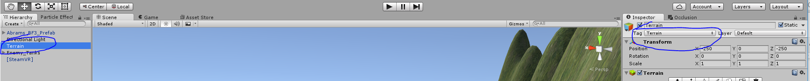

We almost have a complete game now. All we need are some enemies and a
goal.

So to create enemies let’s get an asset from the asset store. There is a
really low polygon tank called 38t. It is included in your lesson
package under Prefabs, it is called Enemy\_Tank. We are going to use
this tank to be our enemy and create a brain for it, to allow it to move
around the world.

First make a gameobject called Enemy\_Tanks, this will be the root node
for all of our enemies, and drag enemies around the map and make them
part of the Enemy\_Tanks node.

Now we should add some tags into the game. These tags are going to be
used to handle raycasting to find the player, and also to detect the
terrain.

Enemy Tanks already has the brain script attached to it, here is a
rundown of how it works:

We have 2 main methods that run every frame on Update():

UpdateState();

TickState();

UpdateState examines the current state and decides if we need a new
state or not.

TickState moves the current state forward in whatever way it can.

UpdateState will first call CheckTargetVisible() which will shoot a
raycast from the enemy tank to the player. If it hits terrain it sits
around and waits until the player comes into view. Once the player is in
view it switches its state to GETTING\_CLOSER, if the tank is out of
range to fire then it starts moving in the direction of the player until
either the player leaves view again or it gets within range. Once it is
within range it fires as fast as possible (and reloads) until it either
gets out of range again or out of view again or dies.

It is relatively simple AI, it won’t roam around searching for the
player or chase the player around a corner, this would require a bunch
of additional stuff to examine the surrounding terrain and path find the
way to the player, this is all doable but outside the scope of this
tutorial.

You can examine the code here:

~~~
using UnityEngine;
using System.Collections;

public class TankBrainAI : MonoBehaviour {
    private GameObject target;
    private bool canSeeTarget;
    private float distanceToTarget;
    public float minDistanceBeforeFiring = 10f;
    public float moveSpeed = 1f;
    public float reloadTime = 2f;
    private float timeLeftToFire = 2f;
    public float firePowerMultiplier = 4000f;
    public GameObject tank;
    public GameObject tankBody;
    public GameObject tankTurret;
    public GameObject BulletPrefab;
    public int counter = 0;
    private BrainState currentState;
    public enum BrainState
    {
        SCANNING,
        GETTING_CLOSER,
        FIRING
    }
	// Use this for initialization
	void Start () {
        target = GameObject.FindGameObjectWithTag("Player");
	}

	// Update is called once per frame
	void Update () {
        UpdateState();
        TickState();
	}

    private void UpdateState()
    {
        CheckTargetVisible();
        if (canSeeTarget == false)
        {
            currentState = BrainState.SCANNING;
            return;
        }
        if(distanceToTarget <= minDistanceBeforeFiring)
        {
            currentState = BrainState.FIRING;
        }
        else
        {
            currentState = BrainState.GETTING_CLOSER;
        }
    }

    private void TickState()
    {
        switch (currentState)
        {
            case BrainState.GETTING_CLOSER:
                tank.transform.LookAt(target.transform);
                this.transform.position = Vector3.MoveTowards(this.transform.position, target.transform.position, moveSpeed * Time.deltaTime);
                break;
            case BrainState.FIRING:
                if(timeLeftToFire >= 0f)
                {
                    timeLeftToFire -= Time.deltaTime;
                    return;
                }
                else
                {
                    Fire();
                }
                break;
        }
    }

    private void Fire()
    {
        //Always look at the target before you fire.
        tank.transform.LookAt(target.transform);
        GameObject bullet = (GameObject)Instantiate(BulletPrefab, tankTurret.transform.position, Quaternion.identity);
        bullet.GetComponent<Rigidbody>().AddForce(tank.transform.forward * firePowerMultiplier);
        timeLeftToFire = reloadTime;
    }

    public void BulletHit()
    {
        //Bang Bang...
        tankTurret.transform.parent = null;
        tankBody.transform.parent = null;
        tankBody.AddComponent<SphereCollider>();
        tankTurret.AddComponent<SphereCollider>();
        Rigidbody body = tankBody.AddComponent<Rigidbody>();
        body.AddExplosionForce(100f, this.transform.position - (this.transform.up * 2f), 3f);
        Rigidbody turret = tankTurret.AddComponent<Rigidbody>();
        turret.AddExplosionForce(50f, this.transform.position - (this.transform.up * 2f), 2f);
        Destroy(this.gameObject, 3f);
        Destroy(turret.gameObject, 7f);
        Destroy(body.gameObject, 7f);
    }

    private void CheckTargetVisible()
    {
        counter++;
        //This is a trick to make it only raycast once every 20 frames, so we can reduce the cost of raycasting.
        if (counter % 20 == 0)
        {
            RaycastHit hit;
            canSeeTarget = false;
            Vector3 origin = this.transform.position + (this.transform.up * 5f);
           // Debug.DrawLine(origin, (target.transform.position - origin) * 100f, Color.blue, 4f);
            if (Physics.Raycast(origin, (target.transform.position - origin) * 100f, out hit))
            {
                if (hit.collider.tag == "Terrain")
                {
                    return;
                }
                if (hit.collider.tag == "Player")
                {
                    canSeeTarget = true;
                    distanceToTarget = Vector3.Distance(this.transform.position, target.transform.position);
                }
            }
        }
    }
}
~~~
