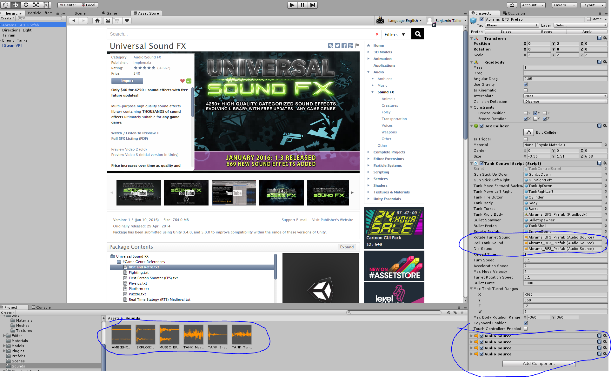
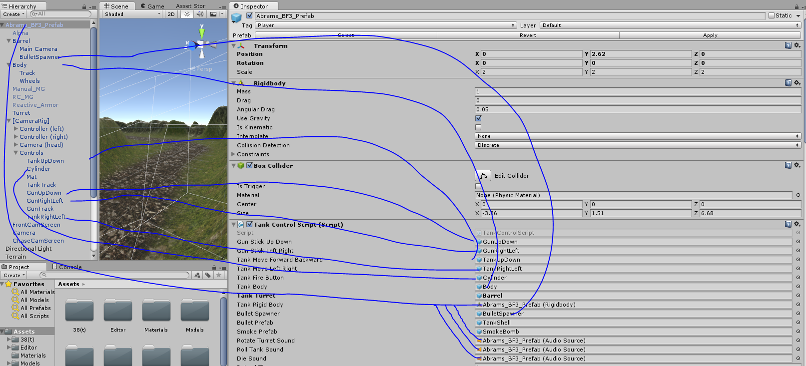

Finally we need to add some sound effects to really get us into the
game.

I have included a number of sounds from the Ultimate Sound FX pack, they
are in the Sounds folder. You can use these sounds in your own games if
you purchase a license for the pack.

Now you can see we have attached 4 audio sources to our main tank. These
include the death sound, the rotate turret sound, the tank movement
sound, and ambient forest wind sound.

We turn all of them to on and loop, but mute them, all except for the
death sound. The death sound is played by script when necessary. The
wind sound is always looping, the rotate turret sound is unmuted while
the turret is being rotated, and the tank movement sound is unmuted
while the tank movement speed is above 5% in either direction. The
explosion sound is attached to the explosion effect and autoplays, and
the tank\_shot sound effect is attached to the bullet. So whenever
anyone, enemy or player shoots a bullet it will play.

Make sure all of your TankControlScript public variables are mapped in
editor like this:

Finally we added some death respawner code to our player so when the
player is shot they jump back to the respawn position and play the death
sound. It doesn’t reset the level, but it can be frustrating because you
need to go all the way back to where you were from the beginning. Kind
of fun to try to make it to the end.

So this concludes our tank game tutorial, I hope you enjoyed it. As
always you can see the final scene file if you have any questions how to
put anything together, but it is always best to rebuild the scene file
from scratch so you understand everything.

Happy VRing!
